# PhotoChoice — 产品需求规格说明书 (PRD)

## 1. 产品定位

**一句话描述**：一个高还原度、可深度定制的 Android 相册选择器组件，对标微信相册选择体验，帮助开发者在自己的应用中快速集成图片/视频选择能力。

**核心价值**：
- **对开发者**：一行代码拉起选择器，丰富的配置项覆盖 80% 的业务场景
- **对用户**：完全遵循 Material Design 规范，操作直觉、流畅，学习成本为零

**设计原则**：
1. **组件化优先** — 以 Library Module 形式存在，不依赖宿主 App 的任何业务逻辑
2. **约定优于配置** — 默认行为即最佳实践，配置项做减法
3. **性能不可妥协** — 大图列表、快速滑动、大量选中，每一个像素的帧率都重要
4. **权限最小化** — 只申请必要权限，渐进式授权

---

## 2. 用户场景

| 场景 | 描述 | 对应能力 |
|------|------|----------|
| S1 单图选择 | 用户更换头像，只需要选一张图片 | 单选模式 + 裁剪 |
| S2 多图选择 | 用户发布朋友圈/动态，选择 1-9 张图 | 多选模式 + 数量限制 |
| S3 单视频选择 | 用户发布短视频 | 仅视频模式 |
| S4 混合选择 | 用户发布图文混排内容，图片+视频 | 混合模式 |
| S5 预览确认 | 选完后想再看看大图效果 | 预览器 |
| S6 现场拍摄 | 用户想直接拍一张照片使用 | 相机入口 |
| S7 按相册筛选 | 用户只想看某个特定相册中的图片 | 相册列表 + 切换 |
| S8 原始画质 | 用户需要发送原图 | 原图开关 |

---

## 3. 产品交互图

### 3.1 页面导航关系

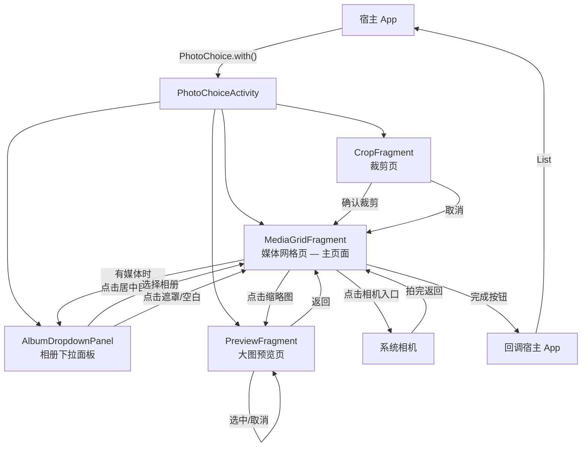

### 3.2 主选择流程（多选模式）

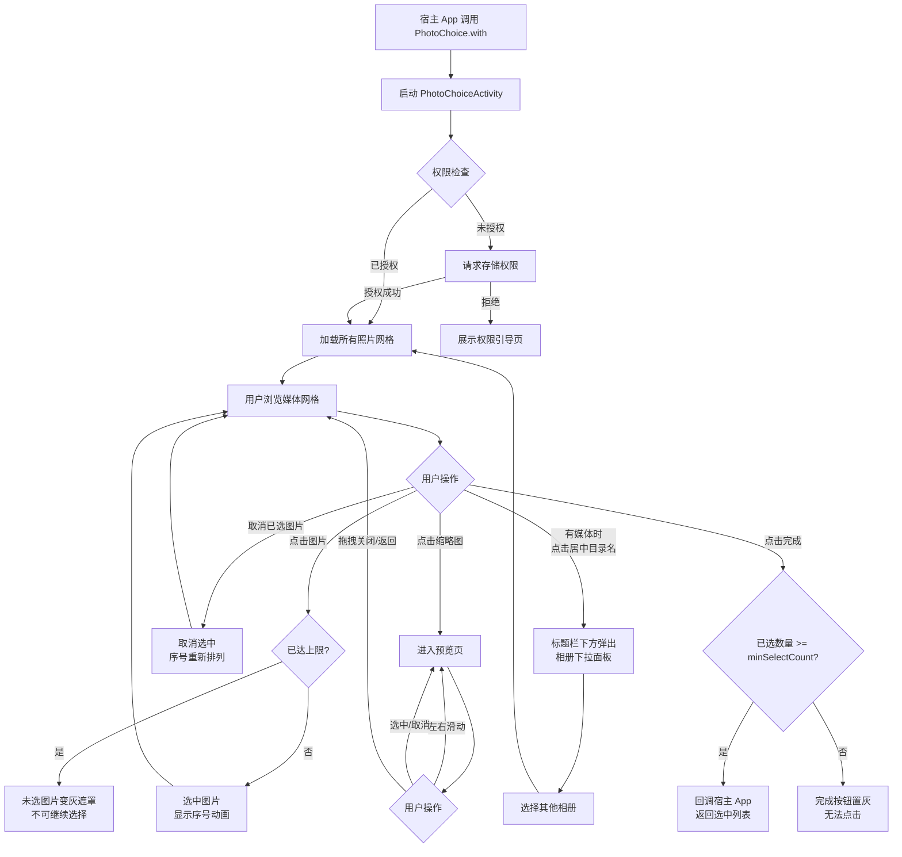

### 3.3 单选 + 裁剪流程

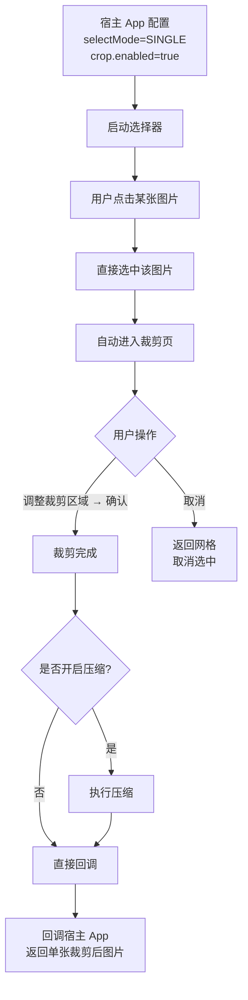

### 3.4 预览页交互流程（含拖拽关闭判定）

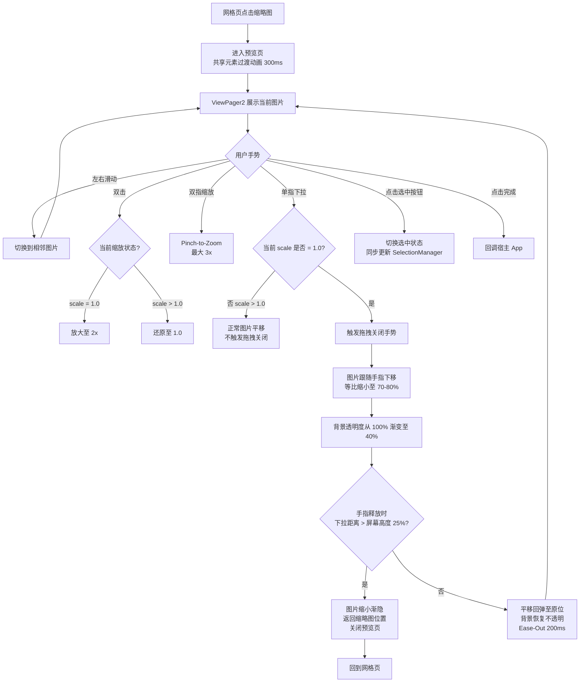

### 3.5 相册下拉面板流程

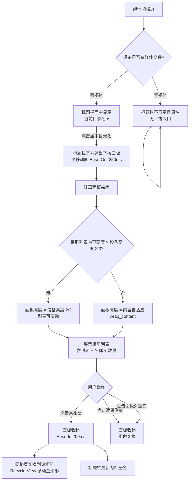

### 3.6 拍照流程

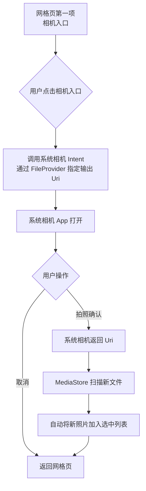

### 3.7 选择状态交互流程

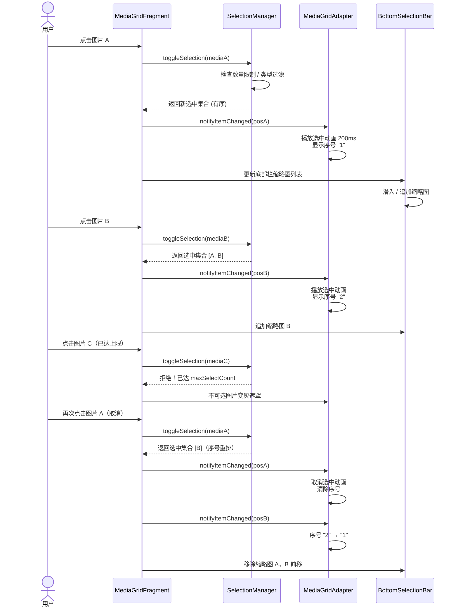

---

## 4. 模型图

### 4.1 领域模型关系

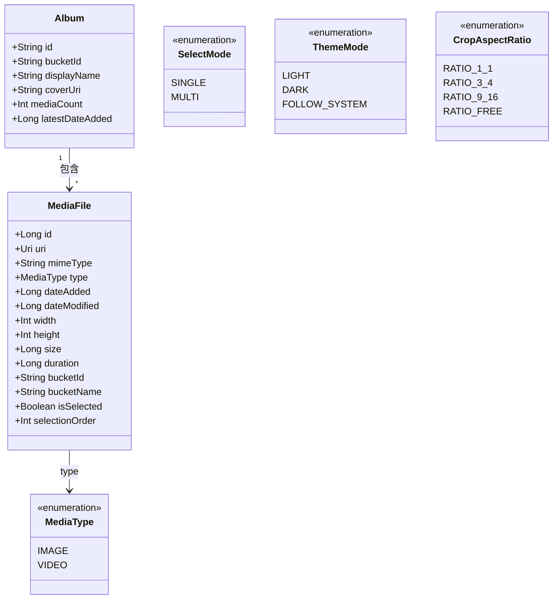

### 4.2 配置模型结构

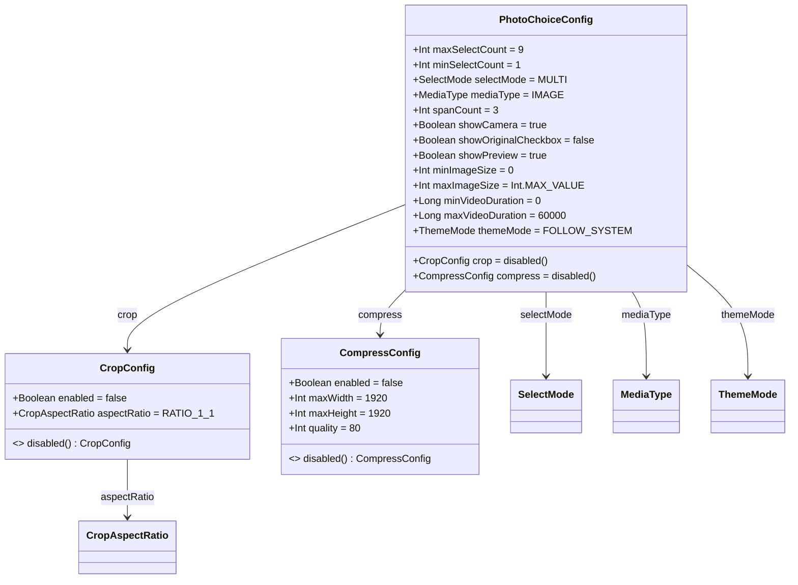

### 4.3 SelectionManager 状态模型

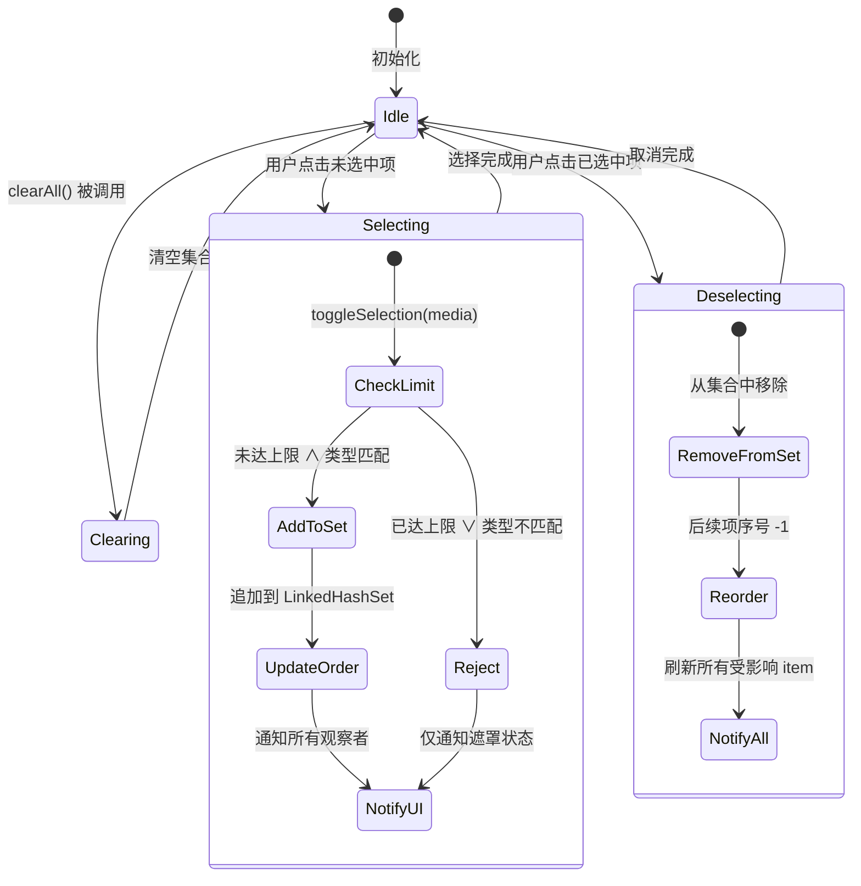

### 4.4 SelectionManager 核心数据结构

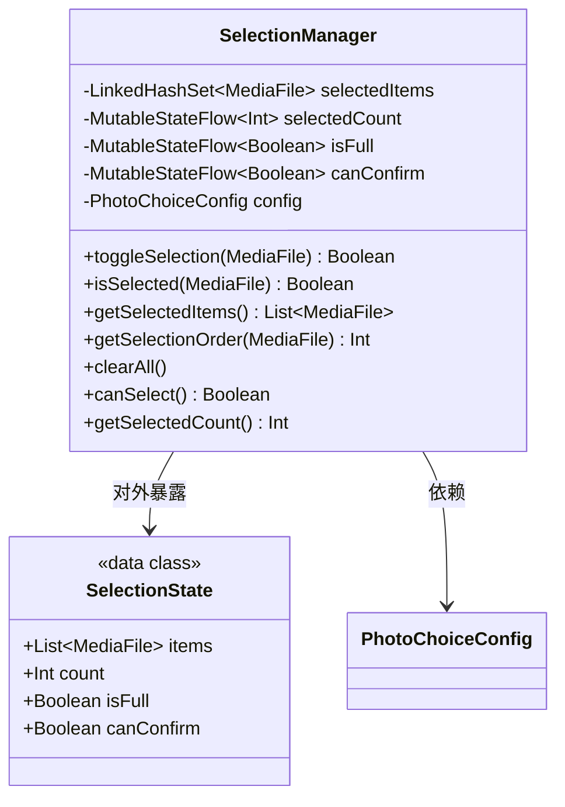

### 4.5 分层架构与数据流向

```mermaid
graph TD
    subgraph "API 层"
        PC[PhotoChoice.kt<br/>Builder 模式入口]
        CFR[PhotoChoiceResult<br/>回调结果]
    end

    subgraph "UI 层"
        PCA[PhotoChoiceActivity]
        ADP[AlbumDropdownPanel]
        MGF[MediaGridFragment]
        PF[PreviewFragment]
        CF[CropFragment]
        BSB[BottomSelectionBar]
    end

    subgraph "ViewModel 层"
        SM[SelectionManager<br/>选中状态核心]
        AVM[AlbumViewModel]
        MGVM[MediaGridViewModel]
        PVM[PreviewViewModel]
    end

    subgraph "Data 层"
        MR[MediaRepository]
        AR[AlbumRepository]
        MPS[MediaPagingSource<br/>Paging 3]
        CH[CompressHelper]
        SC[SandboxCleaner]
    end

    subgraph "System 层"
        MS[MediaStore]
        CR[ContentResolver]
        FP[FileProvider]
        CI[Camera Intent]
    end

    PC --> PCA
    PC --> SM : 注入配置
    PCA --> MGF
    PCA --> ALF
    PCA --> PF
    PCA --> CF

    MGF --> MGVM
    MGF --> BSB
    ALF --> AVM
    PF --> PVM

    MGVM --> SM
    AVM --> SM
    PVM --> SM

    MGVM --> MR
    AVM --> AR
    MR --> MPS
    MPS --> CR
    CR --> MS

    SM --> CFR : 最终回调
    MGVM --> CH : 压缩
    CH --> SC : 沙盒管理
    CF --> FP : 拍照输出 URI

    style SM fill:#f9f,stroke:#333,stroke-width:2px
    style PC fill:#bbf,stroke:#333,stroke-width:2px
```

### 4.6 压缩数据流

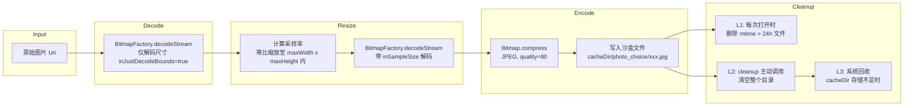

### 4.7 分页加载数据流

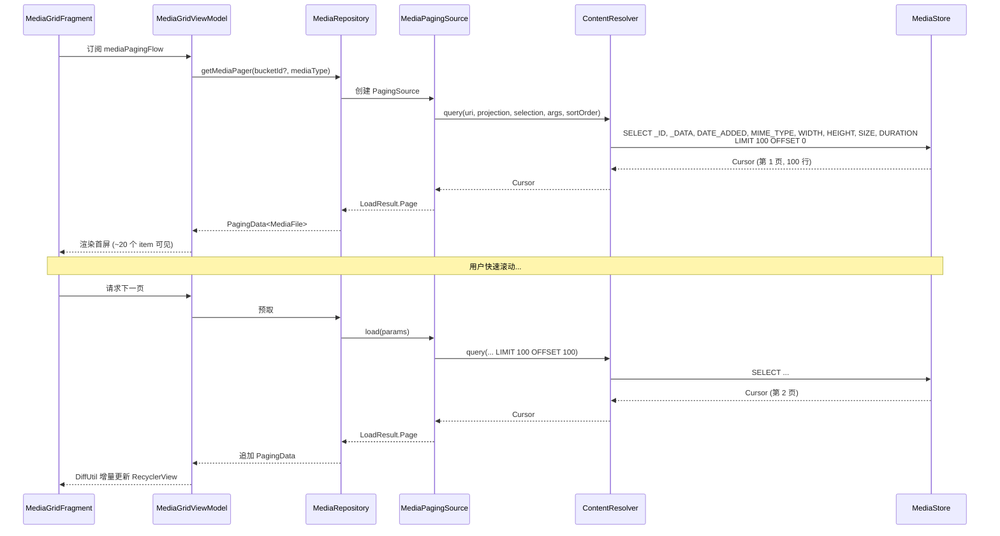

### 4.8 组件依赖关系

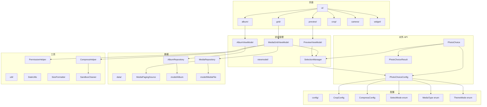

---

## 5. 功能模块拆分

### 5.1 模块总览

```
PhotoChoice (入口 / API 层)
├── AlbumDropdownPanel     相册下拉面板（从标题栏展开）
├── MediaGridFragment      媒体网格页（主选择页）
├── PreviewFragment        预览/大图浏览页
├── CropFragment           裁剪页（仅单选图片时可用）
├── CameraHelper           系统相机 Intent 封装
└── SelectionManager       选中状态管理（ViewModel 层）
```

### 5.2 相册下拉面板

| 功能点 | 描述 | 优先级 |
|--------|------|--------|
| 相册列表 | 展示设备上所有包含图片/视频的相册 | P0 |
| 相册封面 | 每个相册以该目录最近一张图片（按 `DATE_ADDED` 降序取首条）作为封面缩略图 | P0 |
| 相册名称 + 数量 | 显示相册名和媒体文件数量 | P0 |
| "所有照片"项 | 聚合所有相册的照片，默认选中 | P0 |
| 相册排序 | 按媒体数量/更新时间排序 | P0 |
| 相机胶卷置顶 | Camera 目录始终排在前面 | P1 |
| 空相册过滤 | 过滤掉空相册 | P0 |
| 自适应高度 | 内容 ≤ 设备高度 2/3 → wrap_content；> 2/3 → 固定 2/3 高度 + 滚动 | P0 |

交互：
- 有媒体文件时，标题栏居中显示当前目录名 ▾（可点击）
- 无媒体文件时，标题栏不展示目录名，无下拉入口
- 点击居中目录名 → 下拉面板从标题栏下方平移展开（Ease-Out 250ms）
- 面板覆盖在网格内容上方，背景半透明遮罩
- 点击相册项 → 面板收起 + 网格切换到该相册
- 点击遮罩区域或面板外空白 → 面板收起（不做切换）

### 5.3 媒体网格页（核心页面）

| 功能点 | 描述 | 优先级 |
|--------|------|--------|
| 图片网格 | 3-4 列网格展示缩略图 | P0 |
| 时间线分组 | 按日期（今天/昨天/某月某日）分组排列，最新在上 | P1 |
| 多选勾选 | 每张图右上角有方形选择框（2dp 微圆角），点击切换选中状态 | P0 |
| 选中序号 | 多选时选中框内显示数字序号（1,2,3...） | P0 |
| 选择动画 | 选中/取消选中有轻微的缩放+颜色切换动画 | P1 |
| 不可选遮罩 | 达到上限后，未选中的图变为半透明/灰色遮罩 | P0 |
| 快速滚动 | 右侧有日期指示器/快速滚动条 | P2 |
| 下拉关闭 | 手势下拉关闭选择器 | P2 |
| 相机入口 | 网格第一项为相机拍照入口（可配置开关） | P1 |
| 底部选中栏 | 展示已选中媒体的缩略图横向列表 + 预览/完成按钮 | P0 |
| 预览入口 | 点击缩略图进入大图预览 | P0 |
| 加载更多 | 分页加载，避免一次性加载全部图片 | P2 |

状态管理：
- 空状态：无媒体文件时展示空状态占位图
- 权限拒绝状态：权限被拒绝时展示引导提示
- 加载状态：缩略图加载中的骨架屏/placeholder

### 5.4 预览页（大图浏览）

| 功能点 | 描述 | 优先级 |
|--------|------|--------|
| ViewPager 滑动 | 左右滑动切换图片/视频 | P0 |
| 双指缩放 | 支持 pinch-to-zoom，最大放大 3x | P0 |
| 拖拽关闭 | 单指下拉拖拽关闭预览，类似微信朋友圈图片浏览 | P0 |
| 双击缩放 | 双击放大/还原 | P1 |
| 选中/取消 | 底部/顶部有选中按钮，实时切换选中状态 | P0 |
| 视频播放 | 视频项支持播放/暂停 | P1 |
| 序号标记 | 显示当前预览项是已选中的第几个 | P1 |
| 原图开关 | 底部显示"原图"勾选框 | P2 |
| 完成按钮 | 底部完成按钮，显示已选数量 | P0 |

**拖拽关闭的交互细节**：
- 仅当图片缩放比例为 1.0（未放大状态）时，单指下拉才触发拖拽关闭；
- 若图片已放大（scale > 1.0），单指下拉仍为图片平移，需先恢复至原始比例才可拖拽关闭
- 下拉过程中：图片跟随手指位移，同时背景透明度从 100% 线性渐变至 ~40%
- 图片在下拉过程中等比缩小（如缩小至原始尺寸的 70-80%），产生"离你远去"的纵深感
- 释放判定阈值：下拉距离超过屏幕高度 25% → 关闭预览，图片缩小渐隐回到缩略图位置；未超过 → 平移回弹至原位，背景恢复不透明
- 动画曲线：回弹使用 `Ease-Out`，关闭使用 `Ease-In`（扁平无弹性）
- 关闭动画终点：图片缩略图回归到媒体网格中对应缩略图的位置（共享元素返回），衔接自然

### 5.5 拍照/录像

| 功能点 | 描述 | 优先级 |
|--------|------|--------|
| 拍照 | 调用系统相机 Intent 拍照，不内置自定义相机 | P1 |
| 录像 | 可选，调用系统录像 Intent | P2 |
| 拍完即选 | 拍摄完成后自动将照片加入选中列表 | P1 |

### 5.6 图片压缩

| 功能点 | 描述 | 优先级 |
|--------|------|--------|
| 可选压缩 | 由调用方通过配置项决定是否压缩 | P1 |
| 尺寸压缩 | 指定最大宽高，等比压缩，不拉伸 | P1 |
| 质量压缩 | 指定 JPEG 输出质量（0-100） | P1 |
| 沙盒存储 | 压缩后图片存入 `cacheDir/photo_choice/` 目录 | P1 |
| 自动清理 | 每次启动选择器时清理超过 24 小时的旧文件 | P0 |
| 主动清理 | 暴露 `PhotoChoice.cleanup(context)` 供调用方主动清理 | P0 |

**压缩策略**：
- 先做尺寸压缩（若原图宽/高超过 maxWidth/maxHeight，等比缩小至边界内）
- 再做质量压缩（JPEG 编码，quality 默认 80）
- 保留 EXIF 方向信息，确保压缩后图片方向正确

**清理机制（三层防御）**：

| 层级 | 触发条件 | 行为 |
|------|----------|------|
| L1 被动 | 每次打开选择器时 | 扫描压缩目录，删除 mtime > 24h 的文件 |
| L2 主动 | 调用方调用 `PhotoChoice.cleanup(context)` | 立即清空整个压缩目录 |
| L3 系统 | 设备存储空间不足 | Android 系统可能回收 cacheDir（不保证） |

> 调用方职责：在确认图片已处理完毕（上传、保存等）后，调用 `cleanup()`。若调用方忘记，L1 兜底保证不会无限堆积。

### 5.7 裁剪页

| 功能点 | 描述 | 优先级 |
|--------|------|--------|
| 裁剪框 | 固定比例裁剪框（1:1 / 3:4 / 自由比例），可配置 | P1 |
| 手势操作 | 双指缩放 + 单指平移调整裁剪区域 | P1 |
| 预览确认 | 裁剪后预览效果，确认/取消 | P1 |
| 单选限制 | 仅在单选图片模式下可用，多选时不触发裁剪 | P1 |
| 输出回调 | 裁剪结果以 Uri 形式返回 | P1 |

### 5.8 SelectionManager（核心状态管理）

| 功能点 | 描述 | 优先级 |
|--------|------|--------|
| 选中集合 | 维护当前选中的媒体文件集合，保持插入顺序 | P0 |
| 最大数量限制 | 配置最大可选数量，超出时阻止新选 | P0 |
| 最小数量限制 | 配置最少需选数量，不足时完成按钮置灰 | P1 |
| 类型过滤 | 仅图片 / 仅视频 / 图片+视频混合 | P0 |
| 选中顺序 | 记录选中顺序，用于序号展示 | P0 |
| 数据回调 | 最终将选中结果以 List<Uri/Path> 形式回调 | P0 |

---

## 6. 配置项设计

```kotlin
data class PhotoChoiceConfig(
    // ===== 选择模式 =====
    val maxSelectCount: Int = 9,              // 最大可选数量
    val minSelectCount: Int = 1,              // 最小可选数量
    val selectMode: SelectMode = SelectMode.MULTI,  // SINGLE / MULTI

    // ===== 媒体类型过滤 =====
    val mediaType: MediaType = MediaType.IMAGE,      // IMAGE / VIDEO / ALL

    // ===== UI 定制 =====
    val spanCount: Int = 3,                   // 网格列数
    val showCamera: Boolean = true,           // 是否显示拍照入口
    val showOriginalCheckbox: Boolean = false,// 是否显示原图选项
    val showPreview: Boolean = true,          // 是否支持预览

    // ===== 媒体过滤 =====
    val minImageSize: Int = 0,                // 最小图片尺寸过滤（byte）
    val maxImageSize: Int = Int.MAX_VALUE,    // 最大图片尺寸过滤（byte）
    val minVideoDuration: Long = 0L,          // 最短视频时长过滤（ms）
    val maxVideoDuration: Long = 60_000L,     // 最长视频时长过滤（ms），默认 60s

    // ===== 图片裁剪 =====
    val crop: CropConfig = CropConfig.disabled(),

    // ===== 图片压缩 =====
    val compress: CompressConfig = CompressConfig.disabled(),

    // ===== 主题 =====
    val themeMode: ThemeMode = ThemeMode.FOLLOW_SYSTEM, // LIGHT / DARK / FOLLOW_SYSTEM
    // 注：主题色、字体等不再暴露配置项，统一走内置 Design Token 体系，
    // 保证视觉一致性，避免调用方随意搭配破坏美感
)

data class CropConfig(
    val enabled: Boolean = false,
    val aspectRatio: CropAspectRatio = CropAspectRatio.RATIO_1_1, // 裁剪比例
) {
    companion object {
        fun disabled() = CropConfig(enabled = false)
    }
}

enum class CropAspectRatio {
    RATIO_1_1,     // 1:1 头像
    RATIO_3_4,     // 3:4
    RATIO_9_16,    // 9:16 全屏
    RATIO_FREE,    // 自由裁剪
}

data class CompressConfig(
    val enabled: Boolean = false,
    val maxWidth: Int = 1920,             // 最大宽度（px）
    val maxHeight: Int = 1920,            // 最大高度（px）
    val quality: Int = 80,                // JPEG 质量 0-100
) {
    companion object {
        fun disabled() = CompressConfig(enabled = false)
    }
}
```

---

## 7. 交互动效规范

扁平风格动效原则：**干净利落，无弹性无弹跳。** 所有动效使用线性或轻微缓动曲线，避免拟物化的弹性/弹簧效果。

| 动效 | 描述 | 时长 | 曲线 |
|------|------|------|------|
| 选中框填充 | 方形选中框从灰色描边变为黑色填充 | 150ms | Linear |
| 选中序号出现 | 填充完成后白色数字淡入 | 100ms | Linear |
| 序号平移更新 | 相邻选中项序号数字直接替换 | 150ms | Linear |
| 底部栏滑入 | 底部栏从屏幕底部平移滑入 | 200ms | Ease-Out |
| 底部栏滑出 | 底部栏向屏幕底部平移滑出 | 150ms | Ease-In |
| 不可选遮罩 | 纯色遮罩淡入覆盖 | 150ms | Linear |
| 相册下拉展开 | 面板从标题栏下方平移滑出 + 遮罩淡入 | 250ms | Ease-Out |
| 相册下拉收起 | 面板平移滑回标题栏 + 遮罩淡出 | 200ms | Ease-In |
| 预览入场 | 缩略图直接展开至全屏 | 250ms | Ease-Out |
| 拖拽关闭-下拉 | 图片跟随手指 + 背景直接变暗 + 图片缩小 | 实时跟随 | — |
| 拖拽关闭-回弹 | 释放后平移回弹至原位 | 200ms | Ease-Out |
| 拖拽关闭-退出 | 释放后图片缩放淡出至缩略图位置 | 200ms | Ease-In |

---

## 8. UI 原型图

> 以下原型图基于 3 列网格（`spanCount=3`）、亮色主题的默认配置绘制。标注中的尺寸和色值均来自 Design Token 规范。

---

### 8.1 媒体网格页 — 默认态（亮色 / Flat）

```
┌──────────────────────────────────────────────┐  ─┐
│ ▌ Status Bar (dark icons, flat)              │   │ 24dp
├──────────────────────────────────────────────┤  ─┤
│  ←            所有照片 ▾                     │   │ 56dp
│                                              │   │ Toolbar
│  ────────────────────────────────────────    │   │ 1px divider #EEEEEE
├──────────────────────────────────────────────┤  ─┤
│                                              │   │
│  ┌─────┐ ┌─────┐ ┌─────┐                    │   │
│  │  ─   │ │     │ │     │                    │   │
│  │  📷  │ │ img │ │ img │                    │   │
│  │  ─   │ │     │ │     │                    │   │
│  └─────┘ └─────┘ └─────┘                    │   │
│           □       □       □                  │   │ ← 方形选择框
│                                              │   │   (accent_light #D0D0D0)
│  ┌─────┐ ┌─────┐ ┌─────┐                    │   │   2dp 微圆角
│  │     │ │     │ │     │                    │   │   1.5dp 线框描边
│  │ img │ │ img │ │ img │                    │   │
│  │     │ │     │ │     │                    │   │
│  └─────┘ └─────┘ └─────┘                    │   │
│    □       □       □                         │   │
│                                              │   │
│  ── 5月15日 ──────────────────────────────── │   │ ← 日期分组 header
│                                              │   │   (12sp, #888888)
│  ┌─────┐ ┌─────┐ ┌─────┐                    │   │
│  │     │ │     │ │     │                    │   │
│  │ img │ │ img │ │ img │                    │   │
│  │     │ │     │ │     │                    │   │
│  └─────┘ └─────┘ └─────┘                    │   │
│    □       □       □                         │   │
│                                              │   │
│  ┌─────┐ ┌─────┐ ┌─────┐                    │   │
│  │     │ │     │ │     │                    │   │
│  │ img │ │ img │ │ img │                    │   │
│  │     │ │     │ │     │                    │   │
│  └─────┘ └─────┘ └─────┘                    │   │
│    □       □       □                         │   │
│                                              │   │
│  ────────────────────────────────────────    │   │ 1px divider
├──────────────────────────────────────────────┤  ─┤
│ [■■] [■■] [■■] [■■]       [预览] [完成(0)]  │   │ 48dp
│                                              │   │ Bottom Bar
└──────────────────────────────────────────────┘  ─┘  (bg_surface #FAFAFA)
```

**图例说明：**
- 顶部 Toolbar：左侧线框返回箭头 `←`（1.5dp 描边）、**目录名"所有照片 ▾"居中显示**（有媒体文件时展示，可点击弹出下拉面板；无媒体文件时不展示目录名，无下拉入口）
- Toolbar 底部一条 1px 细分割线 (`divider #EEEEEE`)，扁平无阴影
- 网格第一格（`📷`）为相机入口，纯色背景 `camera_tile #F5F5F5`，36dp 线框相机图标居中
- 每张缩略图右上角 `□` 方形选择框，2dp 微圆角，1.5dp 描边 `accent_light #D0D0D0`，边长 22dp
- 缩略图 0dp 直角，grid_spacing 4dp（左右 + 上下）
- 日期分组标题：左对齐，`text_caption 12sp #888888`，section_gap 28dp
- 底部栏背景 `bg_surface #FAFAFA`，顶部 1px divider 分隔，无 elevation
- 所有 UI 元素零阴影（elevation=0dp）

---

### 8.2 媒体网格页 — 选中态（Flat / 已选 3 张，达到上限 9 张）

```
┌──────────────────────────────────────────────┐
│ ←            所有照片 ▾                       │
│  ────────────────────────────────────────    │
├──────────────────────────────────────────────┤
│  今天                                        │
│  ┌─────┐ ┌─────┐ ┌─────┐                    │
│  │  ─   │ │     │ │     │                    │
│  │  📷  │ │ img │ │ img │                    │
│  │  ─   │ │     │ │     │                    │
│  └─────┘ └─┬─┬─┘ └─┬─┬─┘                   │
│           ┌───┐   ┌───┐                       │
│           │ ① │   │ ② │                       │ ← 方形选中框 2dp 圆角
│           └───┘   └───┘                       │   accent #1A1A1A 填充
│                                              │   text_on_accent #FFF 数字
│  ┌─────┐ ┌─────┐ ┌ ─ ─ ─ ─ ┐                │   边长 22dp
│  │     │ │     │ ┆ ░░░░░░░░ ┆               │
│  │ img │ │ img │ ┆ ░░img░░░ ┆               │ ← 不可选遮罩
│  │     │ │     │ ┆ ░░░░░░░░ ┆               │   disabled_overlay #E0E0E0
│  └─────┘ └─┬─┬─┘ └ ─ ─ ─ ─ ┘                │   纯色覆盖，150ms Linear
│          ┌───┐                                │
│          │ ③ │                                │
│          └───┘                                │
│                                              │
│  ── 5月15日 ──────────────────────────────── │
│  ┌─────┐ ┌ ─ ─ ─ ┐ ┌ ─ ─ ─ ┐               │
│  │     │ ┆ ░░░░░░ ┆ ┆ ░░░░░░ ┆               │
│  │ img │ ┆ ░img ░░ ┆ ┆ ░img ░░ ┆              │ ← 所有未选图纯色遮罩
│  │     │ ┆ ░░░░░░ ┆ ┆ ░░░░░░ ┆               │
│  └─────┘ └ ─ ─ ─ ┘ └ ─ ─ ─ ┘               │
│    □       ■         ■                        │ ← 遮罩上方框也变灰
│                                              │
│  ────────────────────────────────────────    │
├──────────────────────────────────────────────┤
│ [■■] [■■] [■■]          [预览] [完成(3)]     │ ← 完成按钮数字实时更新
└──────────────────────────────────────────────┘
```

**图例说明：**
- `①` `②` `③`：方形选中框（2dp 圆角），填充色 `accent #1A1A1A`，白色数字 `text_on_accent #FFFFFF` 加粗 12sp，边长 22dp
- `░░░` 纯色遮罩：达到 `maxSelectCount=9` 后，所有未选缩略图覆盖 `disabled_overlay #E0E0E0`（纯色非半透明），淡入 150ms Linear
- 底部栏完成按钮：未达 minSelectCount 时灰色，达到后变为 accent 色填充
- 选中动画：方形框从灰色描边变为黑色填充（150ms Linear），白色数字淡入（100ms Linear）
- 序号更新时相邻数字直接替换（150ms Linear），无弹跳无缩放

---

### 8.3 媒体网格页 — 暗色主题（Flat）

```
┌──────────────────────────────────────────────┐
│ ▌ Status Bar (light icons, flat dark)        │
├──────────────────────────────────────────────┤
│  ←            所有照片 ▾                       │ ← bg_primary #121212
│  ────────────────────────────────────────    │ ← divider #2A2A2A
├──────────────────────────────────────────────┤
│  今天                                        │ ← text_primary #F0F0F0
│                                              │
│  ┌─────┐ ┌─────┐ ┌─────┐                    │
│  │  ─   │ │     │ │     │                    │
│  │  📷  │ │ img │ │ img │                    │
│  │  ─   │ │     │ │     │                    │
│  └─────┘ └─┬─┬─┘ └─┬─┬─┘                   │
│           ┌───┐   □                           │
│           │ ① │                               │ ← accent #F5F5F5 白底
│           └───┘                               │   text_on_accent #121212 黑字
│                                              │   accent_light #444444 描边
│  ┌─────┐ ┌─────┐ ┌─────┐                    │
│  │     │ │     │ │     │                    │
│  │ img │ │ img │ │ img │                    │
│  │     │ │     │ │     │                    │
│  └─────┘ └─────┘ └─────┘                    │
│    □       □       □                         │
│                                              │
│  ────────────────────────────────────────    │
├──────────────────────────────────────────────┤
│ [■■] [■■]        [预览] [完成(1)]             │ ← bg_surface #1C1C1C
└──────────────────────────────────────────────┘
```

**图例说明（与亮色主要差异）：**
- 页面背景 `bg_primary #121212`（深灰扁平），底部栏 `bg_surface #1C1C1C`
- 选中框反白：填充 `accent #F5F5F5`（白），数字 `text_on_accent #121212`（黑）
- 未选中框描边 `accent_light #444444`，方形 2dp 圆角
- 分割线 `divider #2A2A2A`，1px，扁平分隔
- 遮罩 `disabled_overlay #333333` 纯深色覆盖（非半透明）
- 全线框图标，1.5dp 描边，无填充
- 零 elevation，所有分隔仅靠 1px divider 和色差

---

### 8.4 相册下拉面板 — 有相册数据（Flat）

```
┌──────────────────────────────────────────────┐
│ ▌ Status Bar                                  │
├──────────────────────────────────────────────┤
│ ←            所有照片 ▾                       │ ← 目录名居中
│  ────────────────────────────────────────    │
├──────────────────────────────────────────────┤
│                                              │
│  ░░░░░░░░░░░░░░░░░░░░░░░░░░░░░░░░░░░░░░░░░ ░ │ ← 遮罩覆盖网格
│  ░░░░░░░░░░░░░░░░░░░░░░░░░░░░░░░░░░░░░░░░░ ░ │   bg_mask #99000000
│ ┌──────────────────────────────────────────┐ │ ← 面板从标题栏下方展开
│ │                                          │ │   直角 0dp, 纯白 bg_primary
│ │  所有照片                        ✓      │ │   当前选中项
│ │  ┌────┐                                 │ │
│ │  │■■■■│ 所有照片              2,345 张  │ │   封面 48dp 直角
│ │  └────┘                                 │ │   相册名 15sp regular
│ │  ─────────────────────────────────────  │ │   1px divider
│ │                                          │ │
│ │  ┌────┐                                 │ │
│ │  │■■■■│ 微信                    567 张  │ │
│ │  └────┘                                 │ │
│ │  ─────────────────────────────────────  │ │
│ │                                          │ │
│ │  ┌────┐                                 │ │
│ │  │■■■■│ 相机                    321 张  │ │
│ │  └────┘                                 │ │
│ │  ─────────────────────────────────────  │ │
│ │                                          │ │
│ │  ┌────┐                                 │ │
│ │  │■■■■│ 截图                     89 张  │ │
│ │  └────┘                                 │ │
│ │  ─────────────────────────────────────  │ │
│ │                                          │ │
│ │  ...（更多相册可滚动）                      │ │
│ │                                          │ │
│ └──────────────────────────────────────────┘ │ ← 面板底部
│                                              │   高度 ≤ 设备高度 2/3
│  ░░░░░░░░░░░░░░░░░░░░░░░░░░░░░░░░░░░░░░░░░ ░ │   超出 → 固定 2/3 + 滚动
│  ░░░░░░░ (面板下方仍为遮罩区域) ░░░░░░░░░░░░░ ░ │
└──────────────────────────────────────────────┘
```

**图例说明：**
- **前置条件**：仅当设备有媒体文件时，标题栏才展示居中目录名并提供下拉入口；无媒体时不展示目录名，无法触发下拉
- **触发**：有媒体时，点击标题栏居中目录名"所有照片 ▾"，面板从标题栏下方平移滑出（Ease-Out 250ms）
- **高度逻辑**：
  - 计算列表内容总高度 (itemHeight × itemCount)
  - 若内容高度 ≤ 设备屏幕高度 × 2/3 → 面板高度 wrap_content（自适应内容）
  - 若内容高度 > 设备屏幕高度 × 2/3 → 面板高度固定为 2/3 屏幕高度 + 内部列表可滚动
- **关闭**：点击相册项 / 点击面板外遮罩区域 → 面板平移滑回标题栏（Ease-In 200ms）
- 面板宽度与屏幕等宽，从标题栏正下方开始，向下展开
- 背景网格覆盖纯色遮罩 `bg_mask #99000000`


### 8.5 预览页（大图浏览 / Flat）

```
┌──────────────────────────────────────────────┐
│ ▌ Status Bar (light icons, flat black)       │ ← bg_overlay #000000
├──────────────────────────────────────────────┤
│                                              │
│  ← 返回    ① / 9          [  ✓  已选中 ]   │ ← 顶部浮动栏
│                                              │   方形选中框 2dp 圆角
│                                              │
│                                              │
│                   ┌─────────────┐            │
│                   │             │            │
│                   │             │            │
│                   │   当前图片    │            │
│                   │  (双指缩放)  │            │
│                   │  (双击缩放)  │            │
│                   │             │            │
│                   │             │            │
│                   └─────────────┘            │
│                                              │
│                                              │
│                                              │
│                                              │
│                                              │
├──────────────────────────────────────────────┤
│                                              │
│  ☐ 原图                    完成 (5/9)        │ ← 底部浮动栏, 线框方框
│                                              │
└──────────────────────────────────────────────┘
```

**图例说明：**
- 背景 `bg_overlay #000000` 纯黑扁平，图片居中，预览图 0dp 直角全屏
- 顶部浮动栏：线框返回箭头 + 选中序号"①/9" + 方形选中切换框(2dp 圆角)
- 图片支持：双指 pinch-to-zoom（最大 3x）、双击切换（1.0 ↔ 2.0）
- 底部浮动栏：线框方框 `☐` 原图勾选 + 完成按钮
- ViewPager2 左右滑动切换，入场动画 250ms Ease-Out
- 点击非操作区域 → 顶部/底部栏淡入淡出切换显示（Linear 150ms）

---

### 8.6 预览页 — 拖拽关闭进行中（Flat）

```
┌──────────────────────────────────────────────┐
│  ░░░░░░░░░░░░░░░░░░░░░░░░░░░░░░░░░░░░░░░░░░ │ ← 背景透明度降至 ~40%
│  ░░░░░░░░░░░░░░░░░░░░░░░░░░░░░░░░░░░░░░░░░░ │   (bg_overlay 渐变)
│  ░░░░░░░░░░░░░░░░░░░░░░░░░░░░░░░░░░░░░░░░░░ │
│  ░░░░░░░░░░░░░░░░░░░░░░░░░░░░░░░░░░░░░░░░░░ │
│  ░░░░░░░░░░░┌───────────┐░░░░░░░░░░░░░░░░░░ │
│  ░░░░░░░░░░░│           │░░░░░░░░░░░░░░░░░░ │ ← 图片跟随手指下移
│  ░░░░░░░░░░░│  当前图片   │░░░░░░░░░░░░░░░░░░ │   等比缩小至 70-80%
│  ░░░░░░░░░░░│ (缩小中...) │░░░░░░░░░░░░░░░░░░ │
│  ░░░░░░░░░░░│           │░░░░░░░░░░░░░░░░░░ │
│  ░░░░░░░░░░░└───────────┘░░░░░░░░░░░░░░░░░░ │
│  ░░░░░░░░░░░░░░░░░░░░░░░░░░░░░░░░░░░░░░░░░░ │
│  ░░░░░░░░░░░░░░░░░░░░░░░░░░░░░░░░░░░░░░░░░░ │
│  ░░░░░░░░░░░░░░░░░░░░░░░░░░░░░░░░░░░░░░░░░░ │
│  ░░░░░░░░░░░░░░░░░░░░░░░░░░░░░░░░░░░░░░░░░░ │
│                                              │
│  ─ ─ ─ ─ ─ 释放判定线 (屏幕高度 25%) ─ ─ ─ ─ │ ← 超过此线 → 关闭
│                                              │   未超过 → 回弹
│                                              │
│  (背景网格页面逐渐显露)                          │
└──────────────────────────────────────────────┘
```

**图例说明（Flat）：**
- 触发条件：当前图片缩放比例 scale = 1.0 时单指下拉
- 若 scale > 1.0，单指下拉为图片平移，不触发拖拽关闭
- 下拉过程：图片跟随手指 + 等比缩小至 70-80% + 背景直接变暗（无渐变过渡）
- 释放判定：下拉 > 屏幕 25% → 图片缩放淡出至缩略图位置，关闭（200ms Ease-In）
- 释放判定：下拉 ≤ 屏幕 25% → 图片平移回弹至原位（200ms Ease-Out，无弹性）
- 关闭动画：共享元素过渡回网格缩略图位置

---

### 8.7 裁剪页（1:1 比例 / Flat）

```
┌──────────────────────────────────────────────┐
│ ▌ Status Bar                                  │
├──────────────────────────────────────────────┤
│  ← 取消                         确认 ✓       │ ← Toolbar, 线框按钮
│  ────────────────────────────────────────    │ ← 1px divider
├──────────────────────────────────────────────┤
│                                              │
│  ░░░░░░░░░░░░░░░░░░░░░░░░░░░░░░░░░░░░░░░░░░ │ ← 纯色遮罩
│  ░░░░░░░░░░░░░░░░░░░░░░░░░░░░░░░░░░░░░░░░░░ │   bg_mask #99000000
│  ░░░░░░░░░░░░░░░░░░░░░░░░░░░░░░░░░░░░░░░░░░ │
│  ░░░░░░░░░░┌─────────────────┐░░░░░░░░░░░░░ │
│  ░░░░░░░░░░│                 │░░░░░░░░░░░░░ │
│  ░░░░░░░░░░│                 │░░░░░░░░░░░░░ │
│  ░░░░░░░░░░│   裁剪区域(1:1)   │░░░░░░░░░░░░░ │ ← 白色线框 1.5dp
│  ░░░░░░░░░░│   图片缩放+平移    │░░░░░░░░░░░░░ │   直角 0dp 边框
│  ░░░░░░░░░░│                 │░░░░░░░░░░░░░ │
│  ░░░░░░░░░░│                 │░░░░░░░░░░░░░ │
│  ░░░░░░░░░░└─────────────────┘░░░░░░░░░░░░░ │
│  ░░░░░░░░░░░░░░░░░░░░░░░░░░░░░░░░░░░░░░░░░░ │
│  ░░░░░░░░░░░░░░░░░░░░░░░░░░░░░░░░░░░░░░░░░░ │
│  ░░░░░░░░░░░░░░░░░░░░░░░░░░░░░░░░░░░░░░░░░░ │
│                                              │
│  比例: [1:1] [3:4] [9:16] [自由]              │ ← 线框按钮切换栏
│                                              │
└──────────────────────────────────────────────┘
```

**图例说明：**
- 仅 SINGLE + 图片 + crop.enabled=true 时进入
- 裁剪框：白色线框 1.5dp 描边，直角 0dp，无阴影
- 框外纯色遮罩 `bg_mask #99000000`
- 手势：双指缩放 + 单指平移
- 顶部 Toolbar：线框取消/确认按钮
- 底部比例切换栏：文字按钮，当前选中项高亮描边

---

### 8.8 权限拒绝状态（Flat）

```
┌──────────────────────────────────────────────┐
│ ▌ Status Bar                                  │
├──────────────────────────────────────────────┤
│ ←                                            │
│  ────────────────────────────────────────    │
├──────────────────────────────────────────────┤
│                                              │
│                                              │
│                   ┌──────┐                   │
│                   │  🖼   │                   │ ← 线框空状态图标
│                   │  🚫  │                   │   1.5dp 描边
│                   └──────┘                   │
│                                              │
│               需要存储权限                     │ ← text_h1 18sp regular
│                                              │   text_primary #111111
│      为了展示您的照片，请授权访问设备存储        │ ← text_body 14sp
│                                              │   text_secondary #888888
│                                              │
│           ┌──────────────────┐              │
│           │    前往设置       │              │ ← 纯色按钮, accent #1A1A1A
│           └──────────────────┘              │   直角 0dp, 无阴影
│                                              │
└──────────────────────────────────────────────┘
```

**图例说明：**
- 图标线框风格（1.5dp 描边），纯黑/纯白单色
- 文字轻字重 regular，无粗体层次
- 按钮：accent 纯色填充，直角 0dp，文字白色，zero elevation

---

### 8.9 空媒体状态（Flat）

```
┌──────────────────────────────────────────────┐
│ ▌ Status Bar                                  │
├──────────────────────────────────────────────┤
│ ←                                            │ ← 无目录名，无下拉入口
│  ────────────────────────────────────────    │
├──────────────────────────────────────────────┤
│                                              │
│                                              │
│                   ┌──────┐                   │
│                   │  ─   │                   │
│                   │  📷  │                   │ ← 线框图标 1.5dp
│                   │  ✕  │                   │
│                   └──────┘                   │
│                                              │
│                  暂无照片                      │ ← text_h1 18sp regular
│                                              │
│           当前相册没有任何媒体文件              │ ← text_body 14sp
│                                              │   text_secondary #888888
│                                              │
│           ┌──────────────────┐              │
│           │    拍一张照片     │              │ ← 线框按钮, 仅 showCamera=true
│           └──────────────────┘              │   1.5dp 描边, 直角 0dp
│                                              │
└──────────────────────────────────────────────┘
```

**图例说明：**
- 无媒体文件时，标题栏仅显示返回箭头 `←`，**不展示目录名，无下拉入口**
- 空状态图标线框风格，1.5dp 描边
- 文字轻字重 regular
- 操作按钮：线框样式（1.5dp 描边）而非纯色填充，直角 0dp

---

### 8.10 底部选中栏（组件细节 — 三种状态对比 / Flat）

```
状态 A：无选中项（隐藏）
┌──────────────────────────────────────────────┐
│                                              │
│  （底部栏不显示）                               │
│                                              │
└──────────────────────────────────────────────┘

状态 B：已选 3 项
┌──────────────────────────────────────────────┐
│ ──────────────────────────────────────────── │ ← 1px divider #EEEEEE
│  ┌────┬────┬────┐           ┌────┐┌──────┐  │
│  │■■■■│■■■■│■■■■│⋯  预览    │完成││完成(3)│  │
│  │缩略│缩略│缩略│           └────┘└──────┘  │
│  │图1 │图2 │图3 │                            │
│  └────┴────┴────┘                            │
│   ← bg_surface #FAFAFA                       │
└──────────────────────────────────────────────┘
  ← 48dp 高

  缩略图 48dp 方形    当前预览项有 1.5dp       完成按钮:
  item_radius 0dp     accent 色线框包围         - 已选 ≥ minSelectCount → 纯色填充
  间距 2dp                                      - 已选 <  minSelectCount → 灰色线框

状态 C：已选 9 项（达到 maxSelectCount=9）
┌──────────────────────────────────────────────┐
│ ──────────────────────────────────────────── │
│  ┌────┬────┬────┬────┬────┐   ┌──────────┐  │
│  │■■■■│■■■■│■■■■│■■■■│■■■■│⋯ │ 完成(9/9) │  │
│  │ 1  │ 2  │ 3  │ 4  │ 5  │   │  ■ 已满  │  │
│  └────┴────┴────┴────┴────┘   └──────────┘  │
└──────────────────────────────────────────────┘
  缩略图横向滚动                                完成按钮 accent 色填充
  网格未选图片纯色遮罩 #E0E0E0
```

**图例说明（Flat）：**
- 底部栏 48dp，背景 `bg_surface #FAFAFA`，顶部 1px `divider #EEEEEE`，zero elevation
- 缩略图 48dp 正方形，`item_radius 0dp` 直角，间距 2dp
- 当前预览项缩略图包 1.5dp `accent` 色线框（非填充边框）
- 点击缩略图 → 取消选中；点击"预览"→ 跳转预览页
- 完成按钮：未达 minSelectCount → 灰色线框；达标 → accent 纯色填充；直角 0dp
- 底部栏滑入 200ms Ease-Out / 滑出 150ms Ease-In

---

### 8.11 日期分组 Header 组件（Flat）

```
┌──────────────────────────────────────────────┐
│                                              │
│  ── 今天 ─────────────────────────────────  │  36dp 高
│  ┌─────┐ ┌─────┐ ┌─────┐                    │  1px divider line
│  │     │ │     │ │     │                    │
│  │ img │ │ img │ │ img │                    │
│  │     │ │     │ │     │                    │
│  └─────┘ └─────┘ └─────┘                    │
│                                              │
│  ── 昨天 ─────────────────────────────────  │
│  ┌─────┐ ┌─────┐ ┌─────┐                    │
│  │     │ │     │ │     │                    │
│  │ img │ │ img │ │ img │                    │
│  │     │ │     │ │     │                    │
│  └─────┘ └─────┘ └─────┘                    │
│                                              │
│  ── 5月15日 ──────────────────────────────  │
│  ┌─────┐ ┌─────┐ ┌─────┐                    │
│  │     │ │     │ │     │                    │
│  │ img │ │ img │ │ img │                    │
│  │     │ │     │ │     │                    │
│  └─────┘ └─────┘ └─────┘                    │
│                                              │
└──────────────────────────────────────────────┘

Header 规格 (Flat):
  高度: 36dp
  左边距: page_horizontal 16dp
  文字: text_caption 12sp regular (非 medium)
  颜色: text_secondary #888888
  背景: bg_primary #FFFFFF
  分隔线: 1px 通栏 divider #EEEEEE, 零 elevation
  section_gap: 28dp (分组间距, 更透气)
```

**图例说明：**
- 日期分组 Header 为 ItemDecoration，扁平 1px 通栏分割线
- 文字轻字重 regular，颜色 `text_secondary #888888`
- 无背景色块，无 elevation，仅靠细线和留白区分
- section_gap 28dp 宽裕透气

---

## 9. 视觉设计规范（Design Token）

### 9.1 设计理念

**扁平极简，为照片让路。** 相册选择器的 UI 是照片的容器，而不是舞台。所有视觉元素应后退一步，让照片说话。

**扁平设计原则：**
- **零阴影零层级** — 不使用阴影（elevation=0）、渐变或拟物质感，内容之间以细线分割和留白区分
- **纯色块面** — 只用纯色填充，无渐变无纹理，选中态是唯一允许出现高对比色的地方
- **锐利边角** — 缩略图直角 0dp，选中框微圆角 2dp，不拖泥带水
- **线框优先** — 图标使用细线风格（1.5dp 描边），不使用填充图标
- **克制动画** — 过渡动画干净利落，淡入淡出和滑动为主，无弹性/弹跳效果
- **大量留白** — 用呼吸感建立内容层级，不以阴影划分区域
- **无彩色装饰** — 只靠黑白灰单色建立视觉秩序，色彩仅用于选中状态传达

### 9.2 亮色主题（Light / Flat）

```
┌──────────────────────────────────────┐
│ TOKEN              │ HEX       │ 用途            │
├──────────────────────────────────────┤
│ bg_primary         │ #FFFFFF   │ 页面背景，纯白无层级 │
│ bg_surface         │ #FAFAFA   │ 底部栏，比背景略深   │
│ bg_overlay         │ #000000   │ 预览页背景，纯黑     │
│ bg_mask            │ #99000000 │ 模态遮罩，扁平半透明  │
│ text_primary       │ #111111   │ 主文字，高对比       │
│ text_secondary     │ #888888   │ 辅助文字，足够清晰    │
│ text_on_accent     │ #FFFFFF   │ 选中序号文字（白）    │
│ accent             │ #1A1A1A   │ 选中框填充，近黑      │
│ accent_light       │ #D0D0D0   │ 未选中框描边，清晰可见  │
│ divider            │ #EEEEEE   │ 细分割线 1px，扁平分隔  │
│ camera_tile        │ #F5F5F5   │ 相机入口背景         │
│ disabled_overlay   │ #E0E0E0   │ 不可选遮罩，纯色覆盖   │
│ status_bar_style   │ dark      │ 状态栏图标深色        │
└──────────────────────────────────────┘
```

### 9.3 暗色主题（Dark / Flat）

扁平暗色 — 纯色块面，无层级阴影，以明度差区分区域。

```
┌──────────────────────────────────────┐
│ TOKEN              │ HEX       │ 说明                │
├──────────────────────────────────────┤
│ bg_primary         │ #121212   │ 页面背景，最深          │
│ bg_surface         │ #1C1C1C   │ 底部栏，略浅以示分隔      │
│ bg_overlay         │ #000000   │ 预览页背景（纯黑）       │
│ bg_mask            │ #99FFFFFF │ 模态遮罩（白底透明）     │
│ text_primary       │ #F0F0F0   │ 主文字，高对比           │
│ text_secondary     │ #7A7A7A   │ 辅助文字，清晰可辨        │
│ text_on_accent     │ #121212   │ 选中序号文字（黑）        │
│ accent             │ #F5F5F5   │ 选中框填充（白）          │
│ accent_light       │ #444444   │ 未选中框描边，可见但克制   │
│ divider            │ #2A2A2A   │ 细分割线 1px              │
│ camera_tile        │ #1C1C1C   │ 相机入口背景              │
│ disabled_overlay   │ #333333   │ 不可选遮罩，纯深色覆盖     │
│ status_bar_style   │ light     │ 状态栏图标浅色            │
└──────────────────────────────────────┘
```

### 9.4 字体与排版

使用系统原生字体，扁平风格下字重更轻、行距更宽。

```
┌──────────────────────────────────────────────────┐
│ TOKEN              │ 值             │ 用途        │
├──────────────────────────────────────────────────┤
│ font_family        │ sans-serif     │ 全局默认    │
│ text_h1            │ 18sp / regular │ 页面标题，轻字重  │
│ text_h2            │ 15sp / regular │ 相册名，不加粗    │
│ text_body          │ 14sp / regular │ 列表正文         │
│ text_caption       │ 12sp / regular │ 辅助说明         │
│ text_count         │ 13sp / regular │ 数字/计数        │
│ selected_number    │ 12sp / bold    │ 选中框内序号，加粗突出 │
└──────────────────────────────────────────────────┘
```

### 9.5 间距与圆角（Flat）

扁平风格：零圆角图片、细分割线、宽裕留白。

```
┌────────────────────────────────────────────┐
│ TOKEN              │ 值     │ 用途          │
├────────────────────────────────────────────┤
│ grid_spacing       │ 4dp    │ 网格图片间距（左右 = 上下）│
│ page_horizontal    │ 16dp   │ 页面水平边距            │
│ section_gap        │ 28dp   │ 分组日期间距，更透气    │
│ item_radius        │ 0dp    │ 缩略图直角，锋利无边     │
│ preview_radius     │ 0dp    │ 预览图直角，全屏无边     │
│ checkmark_radius   │ 2dp    │ 选中框微圆角，方形为主   │
│ bottom_bar_height  │ 48dp   │ 底部栏高度              │
│ thumbnail_size     │ 48dp   │ 底部栏缩略图尺寸        │
│ camera_icon        │ 36dp   │ 相机入口图标            │
│ divider_thickness  │ 1px    │ 分割线粗细，极细         │
│ icon_stroke_width  │ 1.5dp  │ 线框图标描边粗细        │
└────────────────────────────────────────────┘
```

---

## 10. 技术架构

### 10.1 分层架构

```
┌─────────────────────────────────┐
│  API Layer (PhotoChoice.kt)     │  ← 对外暴露的唯一入口
├─────────────────────────────────┤
│  UI Layer (Fragment/Activity)   │  ← 页面和视图
├─────────────────────────────────┤
│  ViewModel Layer                │  ← 状态管理和业务逻辑
├─────────────────────────────────┤
│  Data Layer (Repository)        │  ← 数据加载和缓存
├─────────────────────────────────┤
│  System Layer (MediaStore)      │  ← 系统媒体库查询
└─────────────────────────────────┘
```

### 10.2 关键技术选型

| 能力 | 方案 | 说明 |
|------|------|------|
| 图片加载 | Glide | 成熟稳定、链式 API，内置内存+磁盘缓存 + BitmapPool |
| 媒体查询 | MediaStore API | Android 官方推荐，API 29+ 无需存储权限 |
| 分页加载 | Paging 3 | 按页查询 MediaStore，首屏秒开，滚动按需加载 |
| 图片预览 | 自定义 ViewPager2 + PhotoView | 支持缩放和滑动 |
| 视频播放 | ExoPlayer | 可选依赖，Media3 |
| 权限管理 | ActivityResultContracts | 官方权限请求 API |
| 拍照 | 系统相机 Intent + FileProvider | 简单可靠，兼容性最好 |
| UI 控件 | AppCompat 变体 | 所有 View 控件统一使用 AppCompat 版本（AppCompatImageView, AppCompatTextView 等），确保跨版本一致性和 Material 主题兼容 |

### 10.2.1 控件规范

- **所有 View 控件必须使用 AppCompat 变体**：
  - `ImageView` → `androidx.appcompat.widget.AppCompatImageView`
  - `TextView` → `androidx.appcompat.widget.AppCompatTextView`
  - `Button` → `androidx.appcompat.widget.AppCompatButton`
  - `CheckBox` → `androidx.appcompat.widget.AppCompatCheckBox`
  - 以此类推，`android.widget.*` 基础控件不得直接在布局中使用
- **ViewGroup 层级避免过度绘制**：
  - 根布局优先使用 `ConstraintLayout`，减少嵌套层级
  - 不在根布局设置与 Theme 背景相同的 `android:background`（lint Overdraw 警告）
  - 单子 View 的 `FrameLayout` 包装考虑用 `merge` 替代或直接移除
  - 背景色统一通过 Theme `android:windowBackground` 设置，不在每个布局重复声明
- `RecyclerView` 等容器控件无需替换（无对应 AppCompat 变体）

### 10.3 模块结构（最终 Library）

```
photo-choice/
├── src/main/java/com/google/photochoice/
│   ├── PhotoChoice.kt              // 入口，Builder 模式
│   ├── config/
│   │   ├── PhotoChoiceConfig.kt    // 配置数据类
│   │   ├── CropConfig.kt           // 裁剪配置
│   │   ├── SelectMode.kt           // 选择模式枚举
│   │   ├── MediaType.kt            // 媒体类型枚举
│   │   └── DesignTokens.kt         // 设计令牌（颜色/字体/间距）
│   ├── ui/
│   │   ├── PhotoChoiceActivity.kt  // 承载容器 Activity
│   │   ├── album/
│   │   │   ├── AlbumDropdownPanel.kt    // 下拉面板（从标题栏展开）
│   │   │   ├── AlbumListAdapter.kt
│   │   │   └── AlbumItem.kt        // 相册数据模型
│   │   ├── grid/
│   │   │   ├── MediaGridFragment.kt
│   │   │   ├── MediaGridAdapter.kt
│   │   │   ├── MediaItem.kt        // 媒体数据模型
│   │   │   └── DateDivider.kt      // 日期分组装饰
│   │   ├── preview/
│   │   │   ├── PreviewFragment.kt
│   │   │   ├── PreviewAdapter.kt
│   │   │   └── DragDismissLayout.kt  // 拖拽关闭手势容器
│   │   ├── crop/
│   │   │   ├── CropFragment.kt
│   │   │   └── CropView.kt           // 裁剪框 + 手势
│   │   ├── camera/
│   │   │   └── CameraHelper.kt       // 系统相机 Intent 封装
│   │   └── widget/
│   │       ├── SelectionIndicator.kt  // 选中序号方框
│   │       ├── BottomSelectionBar.kt  // 底部选中栏
│   │       └── MediaThumbnail.kt      // 缩略图组件
│   ├── viewmodel/
│   │   ├── AlbumViewModel.kt
│   │   ├── MediaGridViewModel.kt
│   │   ├── PreviewViewModel.kt
│   │   └── SelectionManager.kt     // 核心选中管理
│   ├── data/
│   │   ├── MediaRepository.kt
│   │   ├── AlbumRepository.kt
│   │   └── model/
│   │       ├── Album.kt
│   │       └── MediaFile.kt
│   └── util/
│       ├── PermissionHelper.kt
│       ├── DateUtils.kt
│       ├── SizeFormatter.kt
│       ├── CompressHelper.kt       // 图片压缩
│       └── SandboxCleaner.kt       // 沙盒清理
│   ├── data/paging/
│       ├── MediaPagingSource.kt     // Paging 3 数据源，分页查询 MediaStore
│       └── MediaPager.kt            // 封装 PagingData 流
```

### 10.4 高性能加载方案

**目标**：无论设备上有 500 张还是 5 万张图片，用户拉起选择器必须**秒开**，首屏渲染 < 300ms。

#### 10.4.1 为什么不能用传统方案

```
传统方案：ContentResolver.query() → Cursor → 全量加载 → 构建 List → Adapter
                    ↑                          ↑
              快（只是查询）              慢！5 万行 cursor 遍历 = 阻塞主线程 N 秒
```

Paging 3 解决的就是"全量加载"这一步 —— 每次只取一页（~100 条），用户滚动到接近底部时才加载下一页。

#### 10.4.2 分页加载架构

```
MediaStore                    PagingSource                    UI
┌──────────┐    LIMIT 100     ┌──────────────┐   PagingData   ┌────────────────┐
│ 5 万张图  │ ──────────────→ │  分页查询     │ ──────────────→ │ RecyclerView    │
│          │    OFFSET N*100  │  预取 + 缓存  │   Flow<Paging  │ 只渲染可见区域   │
│          │ ←── 下一页 ──── │              │   Data<Media>  │ (约 20 个 item) │
└──────────┘                 └──────────────┘                └────────────────┘
```

#### 10.4.3 查询优化

```
1. 分页查询（Paging 3 核心）
   - 每页 100 条，首屏只需第一页
   - PagingSource 封装 ContentResolver.query()，用 _ID 或 DATE_ADDED 做游标分页
   - PagingConfig(prefetchDistance = 3 * spanCount * 3) 提前预取 3 屏

2. 只查需要的列
   - 只 SELECT _ID, _DATA, DATE_ADDED, MIME_TYPE, WIDTH, HEIGHT, SIZE, DURATION
   - 不 SELECT *，减少 IO 和内存

3. 缩略图加载
   - 网格中：Glide `override()` 指定加载尺寸解码到 ImageView 实际尺寸（不加载原图），内存占用 ≈ 视口大小
   - 预览中：按屏幕分辨率加载，`thumbnail()` 支持渐进加载，不加载原始分辨率
   - Glide 内置 LRU 内存缓存 + 磁盘缓存 + BitmapPool，滚动回看零等待

4. 相册列表查询独立且轻量
   - ALBUM_QUERY: GROUP BY BUCKET_ID 获取相册列表；每个相册封面取 `DATE_ADDED` 降序第一条的 `_ID`/`_DATA` 作为封面缩略图
   - 单次 GROUP BY 查询，不遍历 Cursor 逐条处理
   - 拿到结果即可展示相册列表（< 50ms）
```

#### 10.4.4 性能目标

| 指标 | 目标值 | 说明 |
|------|--------|------|
| 首屏渲染 | < 300ms | 从调用 `with()` 到网格首屏可见 |
| 相册列表 | < 50ms | 相册列表弹窗出现 |
| 滚动帧率 | 60fps | 快速滑动无掉帧 |
| 分页延迟 | < 100ms | 滑到底部到下一页出现 |
| 预览打开 | < 200ms | 点击缩略图到大图可见 |
| 内存峰值 | < 256MB | 5 万张图浏览全程 |

#### 10.4.5 关键实现约束

- **主线程零阻塞**：所有 MediaStore 查询、图片解码、文件 IO 全在后台协程
- **RecyclerView 复用**：grid_item 布局扁平、无嵌套，减少 measure/layout 开销
- **ViewBinding**：避免 findViewById 开销
- **DiffUtil**：Paging 3 + ListAdapter，增量更新而非全量刷新
- **暂停加载**：选择器不可见时（跳转预览/相册下拉面板展开），暂停预取以减少资源占用

---

## 11. 对外开放 API 设计

```kotlin
// 最简调用
PhotoChoice.with(context)
    .maxSelectCount(9)
    .mediaType(MediaType.IMAGE)
    .forResult { uris: List<Uri> ->
        // 处理选中结果
    }

// 完整配置调用
PhotoChoice.with(activity)
    .config(PhotoChoiceConfig {
        maxSelectCount = 1               // 裁剪仅单选有效
        selectMode = SelectMode.SINGLE
        mediaType = MediaType.IMAGE
        spanCount = 3
        showCamera = true
        showOriginalCheckbox = false
        themeMode = ThemeMode.FOLLOW_SYSTEM
        crop = CropConfig(enabled = true, aspectRatio = CropAspectRatio.RATIO_1_1)
        compress = CompressConfig(enabled = true, maxWidth = 1080, quality = 85)
    })
    .forResult { result: PhotoChoiceResult ->
        val uris = result.uris        // 裁剪+压缩后，uri 指向沙盒中的文件
        // 处理完图片后，主动清理沙盒
        PhotoChoice.cleanup(context)
    }
```

---

## 12. 交付物与里程碑

| 阶段 | 内容 | 预计产出 |
|------|------|----------|
| M1 - 基础框架 | 工程搭建、模块划分、数据层、权限、多语言 | 可跑通的基础流程 |
| M2 - 核心选择 | 媒体网格、多选、单选、选中管理 | 选择器基本可用 |
| M3 - 相册切换 | 相册列表、相册切换、底部栏 | 相册切换可用 |
| M4 - 预览 | 大图预览、缩放、拖拽关闭、视频播放 | 预览功能可用 |
| M5 - 高级功能 | 相机入口、裁剪、压缩、原图 | 高级功能可用 |
| M6 - 打磨 | 动画、主题、暗色模式、边缘场景、Cleanup | 达到 1.0 发布标准 |

---

## 13. 技术决策速览

| # | 决策项 | 结论 |
|---|--------|------|
| 1 | 视频时长上限 | **60 秒**（对标微信朋友圈），超过 60s 的视频不出现在可选列表中 |
| 2 | 裁剪能力 | **内置**，仅单选图片模式下可用，通过 `CropConfig` 配置裁剪比例 |
| 3 | 图片压缩 | **内置**，尺寸+质量压缩，沙盒存储 + 24h 自动清理 + `cleanup()` |
| 4 | 主题定制 | **Design Token 内置**，仅开 Light / Dark / FollowSystem 三档 |
| 5 | 数据源 | **仅 MediaStore 公共媒体**，图库能看到的就能选，不加载私有/隐藏目录 |
| 6 | 多语言 | **中文 + 英文**，默认跟随系统，fallback 英文 |
| 7 | 最低版本 | **Android 10 / API 29**，利用 Scoped Storage 能力，无需 `READ_EXTERNAL_STORAGE` |
| 8 | 过时 API 禁用 | **零过时 API**，所有实现必须使用非过时（non-deprecated）API，`@Deprecated` 标注的方法/类一律不得使用 |
| 9 | License | **Apache 2.0** |
