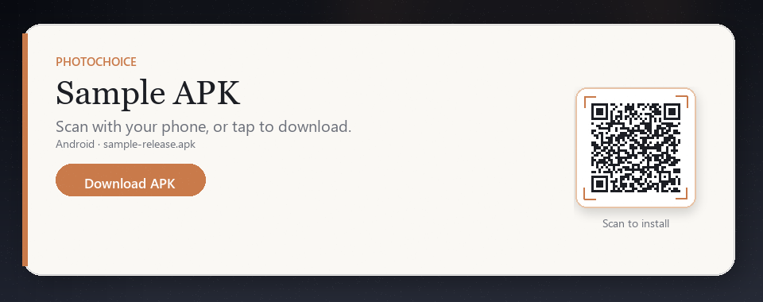

# PhotoChoice

[English Documentation](README.md) | [简体中文文档](README.zh-CN.md) | [日本語ドキュメント](README.ja.md) | [한국어 문서](README.ko.md) | [Documentation en français](README.fr.md) | [الوثائق العربية](README.ar.md) | [Документация на русском](README.ru.md)

Biblioteca de selector de fotos para Android: cuadrícula de selección múltiple, cambio de álbum, vista previa a pantalla completa, mosaico de cámara opcional, recorte de imagen única, compresión opcional y detección de **Motion Photo / Live Photo** con reproducción en la vista previa. Integre mediante una **API Builder** — no inicie las Activity internas directamente.

- **Paquete**: `com.google.photochoice`
- **Versión**: `1.1.0` (ver [CHANGELOG.md](CHANGELOG.md))
- **Min SDK**: 29 (Android 10, Scoped Storage; lectura de medios públicos sin permiso de escritura heredado)
- **Target SDK**: 36
- **Lenguaje**: Kotlin
- **Licencia**: [Apache License 2.0](LICENSE)

---

## Demo

<p align="center">
  <sub><b>VER</b> · <b>PROBAR</b> · <b>INTEGRAR</b></sub>
</p>


<table>
<tr>
<td width="58%" valign="top">

**En este recorrido (~2 min)**

- Cuadrícula y álbumes · orden · fecha al scroll
- Cámara · vista previa · reproducción de vídeo
- Motion / Live Photo · recorte · compresión JPEG
- Tema · Contract / callback

<sub>Archivos: <a href="docs/demo.mp4">demo.mp4</a> · <a href="docs/demo-cover.jpg">cover</a></sub>

</td>
<td width="42%" align="center" valign="middle">

<a href="https://huxiaobai.oss-cn-shanghai.aliyuncs.com/open/sample-release.apk"></a>

<p>
  <a href="https://huxiaobai.oss-cn-shanghai.aliyuncs.com/open/sample-release.apk"><b>⬇ Descargar sample-release.apk</b></a><br>
  <sub>Toca la tarjeta o el enlace · escanea el QR</sub>
</p>

</td>
</tr>
</table>

---

## Funcionalidades

| Funcionalidad | Descripción |
|---------------|-------------|
| Tipos de medios | Solo imágenes / solo vídeos / imágenes + vídeos |
| Selección | Simple o múltiple (`selectCount` 1–9) |
| Álbumes | Agregación de buckets MediaStore con selector desplegable |
| Cuadrícula | Columnas configurables (2–6), miniaturas cuadradas, Paging 3 |
| Encabezado de fecha al desplazar | Muestra la fecha de la región visible al desplazarse |
| Cámara | Mosaico de cámara opcional en la primera celda; las fotos se guardan en `DCIM/Camera` |
| Vista previa | Deslizamiento a pantalla completa; reproducción de vídeo integrada (toque para reproducir, toque durante reproducción solo alterna la interfaz) |
| Motion Photo | Insignia LIVE en la cuadrícula; pulsación larga para reproducir clip integrado en la vista previa |
| Recorte | Selección simple + modo imagen; `CropActivity` independiente |
| Compresión | Redimensionado JPEG + calidad opcional al finalizar; las Live Photos pueden conservar el movimiento o exportar como estática |
| Tema | Claro / oscuro / seguir sistema (por Activity, nunca sobrescribe la app host globalmente) |
| API de lanzamiento | Doble vía: **`PhotoChoiceContract`** (recomendado, sin estado estático) o callback **`forResult`** |
| Seguridad ante process death | El modo Contract sobrevive a la recreación de Activity y al process death; el modo callback tiene detección de degradación elegante |

### Selección simple vs múltiple

| Modo | UI de cuadrícula | Interacción |
|------|-------------------|-------------|
| Múltiple (`selectCount > 1`) | Casilla + insignia de orden de selección | Toque en casilla para alternar; toque en miniatura para vista previa |
| Simple (`selectCount = 1`) | **Oculta** casilla, insignia de orden, overlay deshabilitado | Toque en miniatura → vista previa o recorte (si está activado) |

---

## Captura con la cámara

Con `showCamera(true)` (valor por defecto), la primera celda de la cuadrícula es un acceso a la cámara.

### Ubicación de almacenamiento y nomenclatura

| Elemento | Valor |
|----------|-------|
| Directorio | `DCIM/Camera` (el directorio público de la cámara, es decir, el álbum «Cámara» del sistema) |
| Nombre de archivo | `IMG` + los últimos 8 dígitos de la marca de tiempo + 4 dígitos aleatorios + `.jpg`, p. ej. `IMG064001234821.jpg` |
| Formato | JPEG |

Las fotos se insertan mediante el protocolo de dos fases `IS_PENDING` de MediaStore: la fila solo es visible para la galería del sistema una vez escritos todos los bytes, de modo que ninguna otra aplicación llega a escanear un archivo incompleto.

### Comportamiento tras la captura

| Modo | Comportamiento |
|------|----------------|
| Selección múltiple | La foto se selecciona automáticamente; si ya se alcanzó `selectCount`, se muestra el mensaje de «límite alcanzado» y la foto permanece guardada en la galería |
| Selección única + recorte activado | Va directamente a la pantalla de recorte; al cancelar el recorte se actualiza la lista para que la foto siga visible en la cuadrícula |
| Selección única + recorte desactivado | Solo actualiza la lista y los datos de álbumes, sin selección automática (la selección única no tiene un estado intermedio de «seleccionado») |

**No cambia de álbum**: el álbum que el usuario está viendo permanece igual; solo se actualizan la lista y los agregados de álbumes. Si ese álbum no es «Cámara», la nueva foto será visible tras cambiar a él.

### Qué debe hacer la app anfitriona

**Nada.** La biblioteca declara su propio `FileProvider` (con authority `${applicationId}.photochoice.fileprovider`, construida a partir del `applicationId` de la app anfitriona, de modo que nunca colisiona con otros integradores) y no requiere permiso de cámara: la captura se realiza mediante `ACTION_IMAGE_CAPTURE` y es la propia app de cámara la que posee el permiso.

> Si no hay ninguna app de cámara instalada, al pulsar el mosaico de cámara se muestra un mensaje en lugar de fallar.
> Si su app declara `<uses-permission android:name="android.permission.CAMERA" />` en su propio Manifest, Android exige que ese permiso esté concedido antes de poder usar el intent: es una regla de la plataforma, no un requisito de la biblioteca.

### Degradación ante combinaciones no válidas

Cuando `mediaType` es `VIDEO`, el mosaico de cámara se oculta automáticamente (`effectiveShowCamera`): una imagen fija capturada nunca podría aparecer en una lista que solo muestra vídeos, por lo que no se muestra el acceso.

---

## Motion Photo / Live Photo

La biblioteca trata **Motion Photo, Google Motion Photo, fotos en movimiento Samsung** y archivos JPEG/HEIC similares con vídeo corto integrado como motion photos (siguen siendo de tipo `IMAGE`).

### Lista en cuadrícula

- Insignia **LIVE** en la esquina inferior izquierda de las miniaturas.
- **No bloquea el paging**: el `load` de página solo lee `IS_MOTION_PHOTO` de MediaStore (API 34+) de forma síncrona; el sniff XMP rápido se ejecuta de forma asíncrona.
- **Índice persistente**: los resultados escaneados sobreviven a cambios de configuración y process death; sin re-sniff en cada apertura.
- **Prioridad de viewport**: canal de sniff de alta prioridad dedicado solo a la ventana visible + prefetch — el desplazamiento rápido no se bloquea por una cola histórica completa.
- En OEM que omiten `IS_MOTION_PHOTO` (común en algunos dispositivos), las insignias dependen del sniff XMP cabeza/cola asíncrono; la primera aparición en pantalla puede retrasarse brevemente (normalmente menos de unos cientos de ms).

### Vista previa a pantalla completa

- Insignia LIVE debajo de la barra superior.
- **Pulsación larga** para reproducir vídeo integrado, **soltar** para detener; pellizco/zoom no detiene la reproducción por accidente.
- Detección en segundo plano + precarga del MP4 integrado al entrar (en caché bajo `cacheDir/photo_choice_motion/`).

### Compresión y exportación

Cuando `CompressConfig` está activado, la vista previa ofrece **Conservar live / Exportar estática**:

- **Conservar live** (predeterminado): devuelve URI original, sin compresión.
- **Exportar estática**: compresión JPEG, movimiento descartado.

---

## Inicio rápido

### 1. Añadir la dependencia

**Opción A — Dependencia JitPack (recomendada).**

[](https://jitpack.io/#Hu12037102/photo_choice)

Paso 1 — añada el repositorio JitPack al `settings.gradle.kts` del host (este proyecto usa `FAIL_ON_PROJECT_REPOS`, por lo que el repositorio debe ir en `dependencyResolutionManagement`, no en el `build.gradle.kts` del módulo):

```kotlin
dependencyResolutionManagement {
    repositories {
        google()
        mavenCentral()
        maven { url = uri("https://jitpack.io") }
    }
}
```

Paso 2 — añada la dependencia en el `build.gradle.kts` de la app o módulo de funcionalidad:

```kotlin
dependencies {
    implementation("com.github.Hu12037102:photo_choice:1.1.0")
}
```

> JitPack compila el AAR bajo demanda desde la fuente del tag; la primera petición de un tag nuevo puede tardar un minuto.

**Opción B — Módulo fuente.**
En el `settings.gradle.kts` del host:

```kotlin
include(":photo-choice")
```

En el `build.gradle.kts` de la app o módulo de funcionalidad:

```kotlin
dependencies {
    implementation(project(":photo-choice"))
}
```

### 2. Permisos

La biblioteca declara permisos de lectura de medios en su Manifest; **la app host debe declarar los mismos permisos** y solicitarlos en tiempo de ejecución.

| Versión Android | Permisos |
|-----------------|----------|
| API 34+ | `READ_MEDIA_IMAGES`, `READ_MEDIA_VIDEO` (según `mediaType`), `READ_MEDIA_VISUAL_USER_SELECTED` declarado; concesión parcial tratada como utilizable |
| API 33 | `READ_MEDIA_IMAGES`, `READ_MEDIA_VIDEO` (según `mediaType`) |
| API 29–32 | `READ_EXTERNAL_STORAGE` |

Use `PermissionHelper` para la lista de permisos y verificación de concesión:

```kotlin
import com.google.photochoice.util.PermissionHelper

if (PermissionHelper.hasMediaPermission(context)) {
    openPhotoChoice()
} else {
    requestPermissionLauncher.launch(PermissionHelper.requiredMediaPermissions())
}
```

Vea **`sample`** / `MainActivity` para un ejemplo completo.

### 3. Lanzar el selector (recomendado: Contract)

Use `ActivityResultContract` para integración **segura ante process death**:

```kotlin
import com.google.photochoice.PhotoChoiceContract
import com.google.photochoice.PhotoChoice
import com.google.photochoice.config.MediaType

val launcher = registerForActivityResult(PhotoChoiceContract()) { result ->
    if (result == null) {
        // Usuario canceló
        return@registerForActivityResult
    }
    result.uris.forEach { uri ->
        // URI content:// o file://
    }
}

launcher.launch(
    PhotoChoice.with(this)
        .selectCount(9)
        .mediaType(MediaType.IMAGE)
        .spanCount(4)
        .showCamera(true)
        .buildConfig()
)
```

**El modo Contract** pasa la config vía extras Intent, el resultado vía `setResult()` — ambos gestionados por el sistema, sobreviviendo a recreación de Activity y process death. Sin variables estáticas. **Preferido para todo uso en producción.**

### 4. Alternativa: API callback (legacy)

Desde una **`FragmentActivity`** (o `AppCompatActivity`):

```kotlin
import com.google.photochoice.PhotoChoice
import com.google.photochoice.config.MediaType

PhotoChoice.with(this)
    .selectCount(9)
    .mediaType(MediaType.IMAGE)
    .spanCount(4)
    .showCamera(true)
    .forResult(this) { result ->
        if (result == null) {
            // Usuario canceló
            return@forResult
        }
        result.uris.forEach { uri ->
            // URI content:// o file://
        }
    }
```

**Importante:** La API callback usa campos estáticos internamente y **no sobrevive** a la recreación de Activity host ni al process death. Si la Activity del selector está en ejecución mientras el host es terminado, el callback se pierde y el selector se cierra limpiamente sin resultado. Para fiabilidad, use el enfoque Contract anterior.

---

## Resultado

```kotlin
data class PhotoChoiceResult(
    val uris: List<Uri>,    // URIs seleccionados en orden de selección
    val paths: List<String> // Rutas locales best-effort; cadena URI si no se resuelve
)
```

| Tipo de medio | Sin compresión | Con compresión |
|---------------|----------------|----------------|
| Imagen estática | URI MediaStore `content://` | JPEG comprimido `file://` bajo `cacheDir/photo_choice/compress_*.jpg` |
| Vídeo | URI MediaStore `content://` | Sin cambios (los vídeos nunca se comprimen) |
| GIF | URI MediaStore `content://` | Sin cambios (la compresión perdería la animación) |
| Live Photo (conservar live) | URI MediaStore `content://` | Sin cambios (movimiento preservado) |
| Live Photo (exportar estática) | N/A | JPEG comprimido `file://` bajo `cacheDir/photo_choice/compress_*.jpg` |

Limpiar archivos de caché obsoletos:

```kotlin
PhotoChoice.cleanup(context)
```

Elimina archivos sandbox de más de 24 horas (llame tras procesar el resultado si es necesario).

---

## API Builder

| Método | Tipo | Predeterminado | Descripción |
|--------|------|----------------|-------------|
| `selectCount` | `Int` | `9` | `1` = simple, `>1` = múltiple; auto-clampado a `1..9` |
| `mediaType` | `MediaType` | `IMAGE` | `IMAGE` / `VIDEO` / `ALL` |
| `spanCount` | `Int` | `3` | Columnas de cuadrícula; auto-clampado a **2–6** |
| `showCamera` | `Boolean` | `true` | Mostrar mosaico de cámara en la primera celda; las fotos van a `DCIM/Camera` (ver [Captura con la cámara](#captura-con-la-cámara)) |
| `minImageSize` | `Long` | `0` | Tamaño mínimo de archivo imagen (bytes); filtra iconos pequeños. Solo imágenes |
| `maxImageSize` | `Long` | `Long.MAX_VALUE` | Tamaño máximo de archivo imagen (bytes); filtra imágenes sobredimensionadas. Solo imágenes |
| `minVideoDuration` | `Long` | `0` | Duración mínima de vídeo (ms); auto-intercambiado si > maxVideoDuration |
| `maxVideoDuration` | `Long` | `60000` | Duración máxima de vídeo (ms); auto-intercambiado si < minVideoDuration |
| `themeMode` | `ThemeMode` | `FOLLOW_SYSTEM` | `LIGHT` / `DARK` / `FOLLOW_SYSTEM` (por Activity, nunca global) |
| `cropConfig` | `CropConfig` | ver abajo | Configuración de recorte |
| `compressConfig` | `CompressConfig` | ver abajo | Compresión al finalizar |

Construir por separado para uso Contract:

```kotlin
val config = PhotoChoice.with(context)
    .selectCount(1)
    .buildConfig()  // devuelve PhotoChoiceConfig directamente
```

### Recorte `CropConfig`

Solo cuando **`selectCount = 1`** y **`mediaType` incluye imágenes** — abre `CropActivity` independiente.
El recorte se desactiva automáticamente (degradación silenciosa) para modo solo vídeo o selección múltiple.

```kotlin
import com.google.photochoice.config.CropConfig
import com.google.photochoice.config.CropAspectRatio

.cropConfig(
    CropConfig(
        enabled = true,
        aspectRatio = CropAspectRatio.SQUARE, // ORIGINAL, SQUARE, RATIO_3_4, RATIO_4_3, RATIO_9_16, RATIO_16_9
    )
)
```

Con selección simple + recorte activado, elegir una imagen va directo al recorte, luego devuelve y cierra el selector.

### Compresión `CompressConfig`

Al pulsar **Listo**, escala y comprime en JPEG las **imágenes** antes del callback; vídeos, GIF y Live Photos (modo conservar live) no se comprimen. Las Motion Photos conservan live por defecto; cambie a estática en la vista previa antes de comprimir.

**Estrategia predeterminada (alineada con ajustes comunes tipo WeChat Moments):**

| Parámetro | Predeterminado | Descripción |
|-----------|----------------|-------------|
| `maxWidth` / `maxHeight` | `1280` | Límite del lado más largo |
| `quality` | `80` | Calidad JPEG inicial |
| `maxFileSizeBytes` | `1572864` (~1,5 MB) | Si se excede, calidad reducida por pasos; `0` = sin límite de tamaño |
| `minQuality` | `50` | Calidad mínima en iteración de tamaño |
| `qualityStep` | `10` | Paso de reducción de calidad en cada iteración |

```kotlin
import com.google.photochoice.config.CompressConfig

.compressConfig(
    CompressConfig(
        enabled = true,
        maxWidth = 1280,
        maxHeight = 1280,
        quality = 80,
        maxFileSizeBytes = CompressConfig.DEFAULT_MAX_FILE_SIZE_BYTES,
        minQuality = 50,
        qualityStep = 10
    )
)
```

> **Nota:** La salida es siempre JPEG. PNG/WebP transparentes tendrán fondo negro tras la compresión (comportamiento similar a WeChat y otras apps principales).

---

## Recetas

### Múltiples imágenes (hasta 9)

```kotlin
PhotoChoice.with(activity)
    .selectCount(9)
    .mediaType(MediaType.IMAGE)
    .spanCount(4)
    .showCamera(true)
    .forResult(activity) { result -> /* ... */ }
```

### Avatar (simple + recorte cuadrado)

```kotlin
PhotoChoice.with(activity)
    .selectCount(1)
    .mediaType(MediaType.IMAGE)
    .cropConfig(CropConfig(enabled = true, aspectRatio = CropAspectRatio.SQUARE))
    .compressConfig(CompressConfig(enabled = true))
    .forResult(activity) { result -> /* ... */ }
```

### Solo vídeo (máx. 60 s)

```kotlin
PhotoChoice.with(activity)
    .selectCount(1)
    .mediaType(MediaType.VIDEO)
    .showCamera(false)
    .maxVideoDuration(60_000L)
    .forResult(activity) { result -> /* ... */ }
```

### Imágenes + vídeos

```kotlin
PhotoChoice.with(activity)
    .selectCount(9)
    .mediaType(MediaType.ALL)
    .maxVideoDuration(60_000L)
    .forResult(activity) { result -> /* ... */ }
```

---

## Aplicación de ejemplo

El módulo **`sample`** demuestra todas las opciones:

```bash
./gradlew :sample:installDebug
```

Ejecute **PhotoChoice Sample**, ajuste parámetros, abra el selector y previsualice medios seleccionados desde la lista de resultados.

---

## Arquitectura y rendimiento

### Paging

**Paging 3 + keyset MediaStore** (`DATE_ADDED` + `_ID`) — sin escaneo completo de Cursor:

| Parámetro | Ejemplo (`spanCount = 3`) |
|-----------|---------------------------|
| Carga inicial | ~15 filas × columnas ≈ 45 elementos |
| Tamaño de página | ~25 filas × columnas ≈ 75 elementos |
| Distancia de prefetch | ~35 filas × columnas ≈ 105 elementos (~3 pantallas) |
| Límite de memoria | ~900–1200 elementos de metadatos (descarta páginas más lejanas) |

El `load` de página **no ejecuta análisis XMP** — arranque en frío y desplazamiento rápido permanecen fluidos.

### Pipeline Motion Photo

```
Carga de página MediaStore
    ├─ Sync: API 34+ batch IS_MOTION_PHOTO → MediaFile.isMotionPhoto
    └─ Async (no bloqueante):
           ├─ Apertura de álbum: warmAlbumFromMediaStore
           ├─ Canal viewport: visible + prefetch, sniff XMP alta prioridad
           └─ Canal en segundo plano: ventana prefetch baja prioridad
```

Módulos bajo `data/motion/`: `MotionPhotoDetector`, `MotionPhotoListEnricher`, `MotionPhotoXmpSniffer`, `MotionPhotoVideoResolver`.

### Dependencias clave

- **Glide** — miniaturas e imágenes de vista previa
- **Paging 3** — paging de cuadrícula
- **Media3 ExoPlayer** — reproducción de vídeo / Motion Photo en vista previa
- **ViewPager2** — paging de vista previa

---

## Seguridad de configuración

PhotoChoice aplica **sanitización defensiva** a todos los valores de configuración expuestos, para que una entrada inválida nunca haga crashear la biblioteca:

| Campo | Sanitización |
|-------|--------------|
| `selectCount` | clampado a `1..9`; fuera de rango devuelve `1` |
| `spanCount` | clampado a `2..6` |
| `minVideoDurationMs` / `maxVideoDurationMs` | auto-intercambiado si min > max; min clampado a `>= 0` |
| `minImageSize` / `maxImageSize` | auto-intercambiado si min > max; min clampado a `>= 0` |
| `cropConfig.enabled` | auto-desactivado para modo VIDEO o selección múltiple (`effectiveCropEnabled`) |

---

## Estructura del proyecto

```
photo_choice/
├── photo-choice/              # Biblioteca (API pública: PhotoChoice)
│   └── src/main/java/com/google/photochoice/
│       ├── PhotoChoice.kt     # Entrada Builder, forResult()
│       ├── PhotoChoiceContract.kt     # ActivityResultContract (recomendado)
│       ├── config/
│       ├── data/
│       │   └── motion/        # Detección Motion Photo, XMP, extracción de vídeo
│       ├── viewmodel/
│       └── ui/
│           ├── grid/
│           ├── album/
│           ├── crop/          # CropActivity
│           └── preview/       # PreviewActivity, reproducción live con pulsación larga
├── sample/
├── docs/
│   ├── demo.mp4               # README demo video
│   ├── demo-cover.jpg         # Demo cover frame
│   ├── sample-apk-qr.png      # Sample APK QR
│   └── sample-apk-card.png    # Sample APK download card
├── CHANGELOG.md               # Notas de versión
├── README.md                  # English documentation
├── README.zh-CN.md            # 简体中文文档
├── README.ja.md               # 日本語ドキュメント
├── README.ko.md               # 한국어 문서
├── README.fr.md               # Documentation en français
├── README.es.md               # Este documento (español)
├── README.ar.md               # الوثائق العربية
└── README.ru.md               # Документация на русском
```

---

## Build y verificación

```bash
./gradlew :photo-choice:assembleDebug
./gradlew :sample:installDebug
./gradlew test
./gradlew lint
```

---

## Lista de verificación de integración

- [ ] `implementation(project(":photo-choice"))` (o equivalente Maven)
- [ ] Permisos de lectura de medios en Manifest del host
- [ ] Permiso en tiempo de ejecución antes del lanzamiento (`PermissionHelper`)
- [ ] Elegir API de lanzamiento: **`PhotoChoiceContract`** (recomendado, seguro ante process death) o callback `forResult`
- [ ] Manejar `null` (cancelación) vs `PhotoChoiceResult` (éxito)
- [ ] Llamar `PhotoChoice.cleanup(context)` si se usa compresión/recorte
- [ ] Para Live Photos + compresión, entender **Conservar live / Exportar estática** en la vista previa

---

## Limitaciones

- La fuente de datos es **solo medios públicos MediaStore** — no carpetas privadas/ocultas.
- Colores UI y de acento no son personalizables; solo `ThemeMode` claro/oscuro/sistema.
- No **inicie** `PhotoChoiceActivity`, `PreviewActivity` o `CropActivity` directamente.
- Los filtros de duración de vídeo solo afectan el listado, no los archivos en disco.
- **Insignias LIVE**:
  - Casi instantáneas cuando API 34+ y `IS_MOTION_PHOTO` está en MediaStore.
  - Breve retraso en OEM sin banderas DB (sniff XMP asíncrono en la primera entrada al viewport).
  - La pulsación larga en vista previa aún detecta motion photos sin marcar vía detección completa (incl. XMP).

---

## Problemas

Incluya **versión Android, modelo de dispositivo, fragmento de config, comportamiento esperado vs real**. Para bugs de Motion Photo, indique si la galería del sistema reconoce el elemento como live/Motion Photo.
