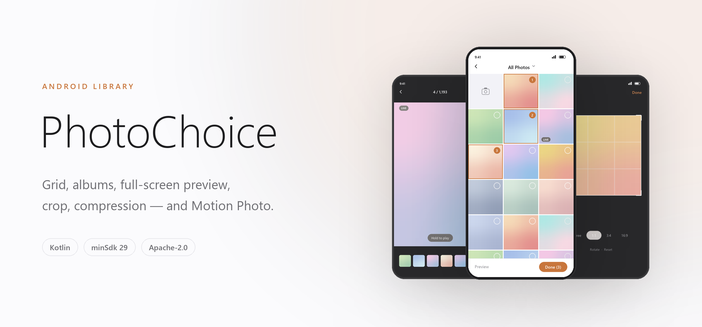
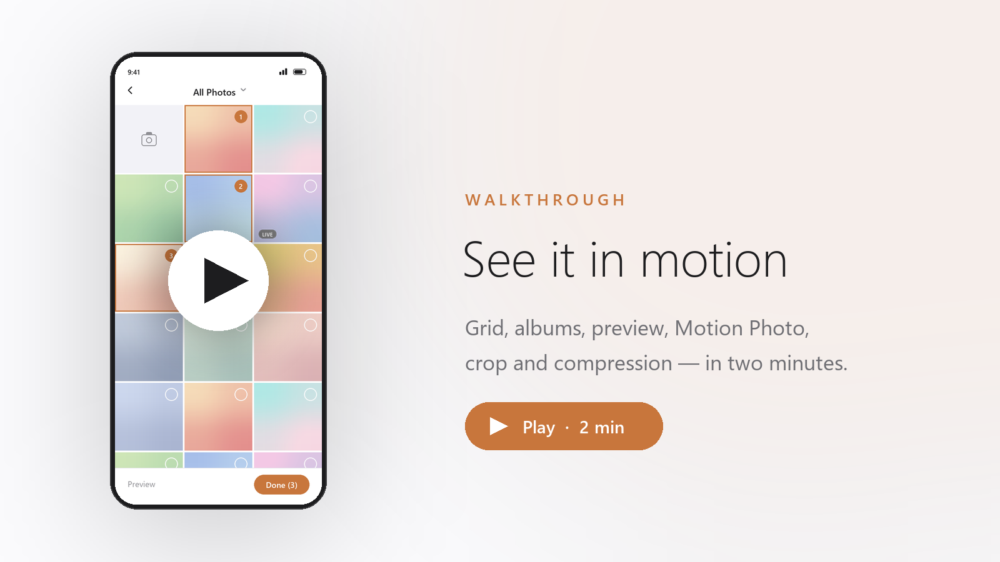

<p align="center">
  <picture>
    <source media="(prefers-color-scheme: dark)" srcset="https://github.com/Hu12037102/photo_choice/raw/master/docs/hero-dark.png">
    
  </picture>
</p>

<p align="center">
  <a href="https://jitpack.io/#Hu12037102/photo_choice"></a>
  
  
  <a href="LICENSE"></a>
</p>

<p align="center">
  <a href="README.md">English</a> ·
  <a href="README.zh-CN.md">简体中文</a> ·
  <a href="README.ja.md">日本語</a> ·
  <a href="README.ko.md">한국어</a> ·
  <a href="README.fr.md">Français</a> ·
  <a href="README.es.md">Español</a> ·
  <a href="README.ar.md">العربية</a>
</p>

<br>

Библиотека выбора фото для Android: сетка с множественным выбором, переключение альбомов,
полноэкранный предпросмотр, опциональная плитка камеры, обрезка одного изображения, опциональное
сжатие и обнаружение **Motion Photo / Live Photo** с воспроизведением прямо в предпросмотре.
Интеграция выполняется через **Builder API** — внутренние Activity библиотеки запускать напрямую
не нужно.

<br>

## Демо

<p align="center">
  <a href="https://github.com/Hu12037102/photo_choice/blob/master/docs/demo.mp4">
    <picture>
      <source media="(prefers-color-scheme: dark)" srcset="https://github.com/Hu12037102/photo_choice/raw/master/docs/demo-poster-dark.png">
      
    </picture>
  </a>
</p>

<p align="center">
  <a href="https://github.com/Hu12037102/photo_choice/blob/master/docs/demo.mp4"><b>Нажмите, чтобы воспроизвести обзор</b></a><br>
  <sub>Сетка и альбомы · порядок выбора · дата при прокрутке · плитка камеры · полноэкранный предпросмотр<br>
  воспроизведение видео · Motion Photo · обрезка · сжатие JPEG · светлая / тёмная / системная тема</sub>
</p>

<br>

<p align="center">
  <a href="https://huxiaobai.oss-cn-shanghai.aliyuncs.com/open/sample-release.apk"></a>
</p>

<p align="center">
  <b><a href="https://huxiaobai.oss-cn-shanghai.aliyuncs.com/open/sample-release.apk">Скачать пример приложения</a></b><br>
  <sub>Отсканируйте телефоном или нажмите для загрузки · <code>sample-release.apk</code> · Android 10+</sub>
</p>

---

## Ключевые возможности

| Область | Что вы получаете |
|---------|------------------|
| Типы медиа | Только изображения / только видео / изображения + видео |
| Выбор | Одиночный или множественный (`selectCount` 1–9), со значками порядка выбора |
| Альбомы | Агрегация бакетов MediaStore с выпадающим переключателем |
| Сетка | Настраиваемое число колонок (2–6), квадратные миниатюры, Paging 3 |
| Заголовок с датой | Показывает дату видимой области при прокрутке |
| Камера | Опциональная плитка камеры в первой ячейке; снимки попадают в `DCIM/Camera` |
| Предпросмотр | Полноэкранный свайп, встроенное воспроизведение видео |
| Motion Photo | Значок LIVE в сетке; долгое нажатие в предпросмотре воспроизводит встроенный клип |
| Обрезка | Одиночный выбор + режим изображений; отдельная `CropActivity` |
| Сжатие | Изменение размера и качества JPEG при завершении, с циклом повторов до целевого размера |
| Тема | Светлая / тёмная / системная, применяется на уровне Activity — глобальный режим хост-приложения не переписывается |
| API запуска | **`PhotoChoiceContract`** (рекомендуется, без статического состояния) или колбэк `forResult` |
| Устойчивость к смерти процесса | Режим Contract переживает пересоздание Activity и смерть процесса |

- **Пакет** `com.google.photochoice` · **Версия** `1.1.0` ([CHANGELOG](CHANGELOG.md))
- **minSdk** 29 (Android 10, Scoped Storage — публичные медиа читаются без устаревшего разрешения на запись)
- **compileSdk** 36 · **Java** 11 · **Kotlin** · [Apache License 2.0](LICENSE)

---

## Установка

### Вариант A — JitPack (рекомендуется)

Добавьте репозиторий JitPack в **`settings.gradle.kts`** хост-проекта. Проект использует
`FAIL_ON_PROJECT_REPOS`, поэтому репозиторий должен находиться в `dependencyResolutionManagement`,
а не в модуле:

```kotlin
dependencyResolutionManagement {
    repositories {
        google()
        mavenCentral()
        maven { url = uri("https://jitpack.io") }
    }
}
```

Затем объявите зависимость в модуле приложения или функциональном модуле:

```kotlin
dependencies {
    implementation("com.github.Hu12037102:photo_choice:1.1.0")
}
```

> JitPack собирает AAR по запросу из исходников по тегу; первый запрос нового тега может занять
> около минуты.

### Вариант B — модуль с исходниками

```kotlin
// settings.gradle.kts
include(":photo-choice")

// app/build.gradle.kts
dependencies {
    implementation(project(":photo-choice"))
}
```

---

## Быстрый старт

### 1. Объявите разрешения

Библиотека объявляет разрешения на чтение медиа в собственном Manifest, но **хост-приложение должно
объявить те же разрешения** и запросить их во время выполнения.

| Версия Android | Разрешения |
|----------------|------------|
| API 34+ | `READ_MEDIA_IMAGES`, `READ_MEDIA_VIDEO`, `READ_MEDIA_VISUAL_USER_SELECTED` — частичная выдача считается пригодной |
| API 33 | `READ_MEDIA_IMAGES`, `READ_MEDIA_VIDEO` |
| API 29–32 | `READ_EXTERNAL_STORAGE` |

`PermissionHelper` предоставляет список и проверку выдачи:

```kotlin
import com.google.photochoice.util.PermissionHelper

if (PermissionHelper.hasMediaPermission(context)) {
    openPhotoChoice()
} else {
    requestPermissionLauncher.launch(PermissionHelper.requiredMediaPermissions())
}
```

`requiredMediaPermissions()` возвращает **полный** набор для текущего уровня SDK и **не** сужает
его в зависимости от вашего `mediaType`. На API 34+ `hasMediaPermission()` возвращает `true`, если
выдано **любое** из трёх (частичный доступ к фото засчитывается); на API 33 требуются **оба**
разрешения — на изображения и на видео.

### 2. Запуск пикера — Contract (рекомендуется)

```kotlin
import com.google.photochoice.PhotoChoice
import com.google.photochoice.PhotoChoiceContract
import com.google.photochoice.config.MediaType

val launcher = registerForActivityResult(PhotoChoiceContract()) { result ->
    if (result == null) return@registerForActivityResult   // отменено
    result.uris.forEach { uri ->
        // URI content:// или file://, в порядке выбора
    }
}

launcher.launch(
    PhotoChoice.with(this)
        .selectCount(9)
        .mediaType(MediaType.IMAGE)
        .spanCount(4)
        .showCamera(true)
        .buildConfig()
)
```

`PhotoChoiceContract` — это `ActivityResultContract<PhotoChoiceConfig, PhotoChoiceResult?>`.
Конфигурация передаётся как extra в Intent, а результат возвращается через `setResult()` — и то и
другое управляется системой, поэтому всё переживает пересоздание Activity и смерть процесса без
единого статического поля. **Предпочтительный вариант для продакшена.**

### 3. Альтернатива — колбэк API (устаревший)

Из `FragmentActivity` (или `AppCompatActivity`):

```kotlin
PhotoChoice.with(this)
    .selectCount(9)
    .mediaType(MediaType.IMAGE)
    .forResult(this) { result ->
        if (result == null) return@forResult   // отменено
        result.uris.forEach { uri -> /* ... */ }
    }
```

> **Колбэк API хранит колбэк в статическом поле.** Поэтому он не переживает пересоздание
> хост-Activity или смерть процесса: если хост будет убит во время работы пикера, колбэк потеряется,
> и пикер завершится корректно, но без результата. Когда это важно, используйте Contract выше.

---

## Конфигурация

Каждый сеттер возвращает `Builder`. Терминальные вызовы — `buildConfig()` (для
`PhotoChoiceContract`), `forResult(activity, callback)` или `build()`, если нужен сам экземпляр
`PhotoChoice`.

| Метод | Тип | По умолчанию | Примечания |
|-------|-----|--------------|------------|
| `selectCount` | `Int` | `9` | `1` = одиночный, `>1` = множественный. Значение вне `1..9` **откатывается к `1`**, а не приводится к ближайшей границе |
| `mediaType` | `MediaType` | `IMAGE` | `IMAGE` / `VIDEO` / `ALL` |
| `spanCount` | `Int` | `3` | Колонки сетки, ограничивается диапазоном `2..6` |
| `showCamera` | `Boolean` | `true` | Плитка камеры в первой ячейке — см. [Съёмка на камеру](#съёмка-на-камеру) |
| `minImageSize` | `Long` | `0` | Минимальный размер файла изображения в байтах; отсеивает мелкие иконки. Только изображения |
| `maxImageSize` | `Long` | `Long.MAX_VALUE` | Максимальный размер файла изображения в байтах. Только изображения |
| `minVideoDuration` | `Long` | `0` | Минимальная длительность видео в мс |
| `maxVideoDuration` | `Long` | `60_000` | Максимальная длительность видео в мс |
| `themeMode` | `ThemeMode` | `FOLLOW_SYSTEM` | `LIGHT` / `DARK` / `FOLLOW_SYSTEM`, применяется на уровне Activity |
| `cropConfig` | `CropConfig` | `CropConfig()` | См. ниже |
| `compressConfig` | `CompressConfig` | `CompressConfig()` | См. ниже |

> **У `spanCount` два разных значения по умолчанию.** У `Builder` это `3`, а у самого параметра
> конструктора `PhotoChoiceConfig` — `4`. Если вы создаёте `PhotoChoiceConfig` напрямую, минуя
> Builder, вы получите 4 колонки.

`PhotoChoice.with(context)` сейчас игнорирует аргумент `context` — он сохранён ради совместимости
API и естественного вида места вызова.

### Обрезка — `CropConfig`

```kotlin
import com.google.photochoice.config.CropConfig
import com.google.photochoice.config.CropAspectRatio

.cropConfig(
    CropConfig(
        enabled = true,
        aspectRatio = CropAspectRatio.SQUARE,
        maxWidth = 0,      // 0 = без ограничения
        maxHeight = 0,     // 0 = без ограничения
    )
)
```

| Поле | По умолчанию | Примечания |
|------|--------------|------------|
| `enabled` | `false` | После выбора открывает отдельную `CropActivity` |
| `aspectRatio` | `ORIGINAL` | `ORIGINAL` / `SQUARE` / `RATIO_3_4` / `RATIO_4_3` / `RATIO_9_16` / `RATIO_16_9`; каждая константа предоставляет `ratio: Float?` (`null` для `ORIGINAL`) |
| `maxWidth` | `0` | Ограничивает ширину результата в пикселях; `0` и меньше — без ограничения |
| `maxHeight` | `0` | Ограничивает высоту результата в пикселях; `0` и меньше — без ограничения |

Обрезка работает только при `selectCount == 1` **и** `mediaType == MediaType.IMAGE`.

> **`MediaType.ALL` молча отключает обрезку.** Проверка — строгое равенство `IMAGE`, а не
> «содержит изображения», поэтому смешанный пикер изображений и видео никогда не доходит до экрана
> обрезки, даже при `enabled = true`.

При одиночном выборе с включённой обрезкой выбор изображения ведёт сразу к обрезке, после чего
пикер закрывается.

### Сжатие — `CompressConfig`

По нажатию **Готово** изображения масштабируются и сжимаются в JPEG перед возвратом результата.
Видео, GIF и Motion Photo в режиме сохранения движения не сжимаются никогда.

```kotlin
import com.google.photochoice.config.CompressConfig

.compressConfig(
    CompressConfig(
        enabled = true,
        maxWidth = 1280,
        maxHeight = 1280,
        quality = 80,
        maxFileSizeBytes = CompressConfig.DEFAULT_MAX_FILE_SIZE_BYTES,
        minQuality = 50,
        qualityStep = 10,
    )
)
```

| Поле | По умолчанию | Примечания |
|------|--------------|------------|
| `enabled` | `false` | Главный переключатель |
| `maxWidth` / `maxHeight` | `1280` | Ограничения по длинной стороне при масштабировании |
| `quality` | `80` | Начальное качество JPEG, при использовании ограничивается диапазоном `1..100` |
| `maxFileSizeBytes` | `1_572_864` (~1,5 МБ) | Целевой размер результата; качество ступенчато снижается, пока не уложится |
| `minQuality` | `50` | Нижняя граница этого цикла — ниже не опускается |
| `qualityStep` | `10` | На сколько падает качество за одну попытку |
| `skipCompressBaselineLongEdge` | `1280` | Порог пропуска, длинная сторона |
| `skipCompressBaselineShortEdge` | `720` | Порог пропуска, короткая сторона |
| `skipCompressMaxBytes` | `153_600` (150 КБ) | Порог пропуска, размер файла |

**Изображение, которое уже достаточно маленькое, возвращается без изменений:** длинная сторона
≤ 1280 **и** короткая ≤ 720, **или** файл меньше 150 КБ. Пересжатие таких файлов лишь ухудшило бы
качество без заметной экономии. Motion Photo, экспортированные как статичные, намеренно обходят
это исключение и сжимаются всегда.

> Результат всегда в формате JPEG. Прозрачный PNG или WebP вернётся с чёрным фоном.

---

## Результат

```kotlin
data class PhotoChoiceResult(
    val uris: List<Uri>,    // выбранные URI, в порядке выбора
    val paths: List<String> // по возможности локальные пути; строка URI, если путь не определён
)
```

Настоящие пути файловой системы `paths` содержит только для файлов, созданных самой библиотекой
(результат сжатия или обрезки). Элементы MediaStore возвращают свой `content://` URI строкой.

| Медиа | Без сжатия | Со сжатием |
|-------|------------|------------|
| Статичное изображение | `content://` URI из MediaStore | JPEG `file://` в `cacheDir/photo_choice/compress_<uuid>.jpg` |
| Маленькое изображение (ниже порога пропуска) | `content://` URI из MediaStore | `content://` — без изменений |
| Видео | `content://` URI из MediaStore | Без изменений |
| GIF | `content://` URI из MediaStore | Без изменений (сжатие потеряло бы анимацию) |
| Live Photo — сохранить движение | `content://` URI из MediaStore | Без изменений (движение сохранено) |
| Live Photo — экспорт как статичное | н/д | Сжатый JPEG `file://` |
| Обрезанное изображение | `file://` в `cacheDir/photo_choice/crop_<timestamp>.jpg` | то же, затем сжатие |

### Очистка

```kotlin
PhotoChoice.cleanup(context)
```

> **Этот вызов удаляет всё, а не только старые файлы.** `cleanup()` безусловно очищает
> `cacheDir/photo_choice/`, `cacheDir/photo_choice_motion/` и `cacheDir/photo_choice_camera/`, а
> также сбрасывает кэш Motion Photo в памяти. Вызывайте его **после** того, как вы обработали
> результат: `file://` URI, который вы всё ещё держите, перестанет разрешаться.
>
> Очистка по возрасту в 24 часа — отдельная внутренняя процедура, которую библиотека запускает
> самостоятельно; планировать её вручную не нужно.

---

## Рецепты

```kotlin
// Несколько изображений, до 9
PhotoChoice.with(activity)
    .selectCount(9)
    .mediaType(MediaType.IMAGE)
    .spanCount(4)
    .showCamera(true)
    .forResult(activity) { result -> /* ... */ }

// Аватар: одиночный выбор + квадратная обрезка + сжатие
PhotoChoice.with(activity)
    .selectCount(1)
    .mediaType(MediaType.IMAGE)
    .cropConfig(CropConfig(enabled = true, aspectRatio = CropAspectRatio.SQUARE))
    .compressConfig(CompressConfig(enabled = true))
    .forResult(activity) { result -> /* ... */ }

// Только видео, максимум 60 с
PhotoChoice.with(activity)
    .selectCount(1)
    .mediaType(MediaType.VIDEO)
    .showCamera(false)          // в режиме VIDEO плитка и так скрывается автоматически
    .maxVideoDuration(60_000L)
    .forResult(activity) { result -> /* ... */ }

// Изображения + видео — учтите, что в режиме ALL обрезка недоступна
PhotoChoice.with(activity)
    .selectCount(9)
    .mediaType(MediaType.ALL)
    .maxVideoDuration(60_000L)
    .forResult(activity) { result -> /* ... */ }
```

---

## Поведение подробно

### Одиночный и множественный выбор

| Режим | Интерфейс сетки | Взаимодействие |
|-------|-----------------|----------------|
| Множественный (`selectCount > 1`) | Чекбокс + значок порядка выбора | Нажатие на чекбокс переключает выбор; нажатие на миниатюру открывает предпросмотр |
| Одиночный (`selectCount == 1`) | **Скрывает** чекбокс, значок порядка и слой блокировки | Нажатие на миниатюру → предпросмотр или обрезка, если она включена |

У одиночного выбора нет промежуточного состояния «выбрано», поэтому связанные с выбором элементы
интерфейса исчезают полностью, а не становятся неактивными.

### Съёмка на камеру

При `showCamera(true)` (значение по умолчанию) первая ячейка сетки — вход в камеру.

| Параметр | Значение |
|----------|----------|
| Каталог | `DCIM/Camera` — публичный каталог камеры, то есть системный альбом «Камера» |
| Имя файла | `IMG` + последние 8 цифр временной метки + 4 случайные цифры + `.jpg`, например `IMG064001234821.jpg` |
| Формат | JPEG |
| Промежуточная область | `cacheDir/photo_choice_camera/`, очищается сборщиком песочницы |

Снимки вставляются по двухфазному протоколу `IS_PENDING` из MediaStore: строка становится видимой
системной галерее только после полной записи байтов, поэтому другие приложения никогда не
просканируют частичный файл. Если копирование не удалось, ожидающая строка удаляется, а не остаётся
осиротевшей.

**Что должно сделать хост-приложение: ничего.** Библиотека сама объявляет `FileProvider` с
authority `${applicationId}.photochoice.fileprovider` — оно выводится из `applicationId` хоста,
поэтому конфликт с другим интегратором невозможен. Разрешение камеры тоже не нужно: съёмка идёт
через `ACTION_IMAGE_CAPTURE`, а разрешением владеет само приложение камеры.

> Если приложение камеры не установлено, нажатие на плитку покажет сообщение, а не приведёт к сбою.
>
> Если ваше приложение объявляет `<uses-permission android:name="android.permission.CAMERA" />` в
> собственном Manifest, Android потребует выдать это разрешение прежде, чем интент можно будет
> использовать. Это правило платформы, а не требование библиотеки.

После съёмки:

| Режим | Поведение |
|-------|-----------|
| Множественный | Снимок выбирается автоматически. Если `selectCount` уже достигнут, появляется сообщение о лимите, а снимок всё равно остаётся в галерее |
| Одиночный + обрезка включена | Сразу открывается экран обрезки; отмена обновляет список, и снимок остаётся видимым в сетке |
| Одиночный + обрезка выключена | Обновляются только список и данные альбомов — без автовыбора |

Альбом, который просматривает пользователь, не меняется; обновляются лишь список и агрегаты
альбомов. Если это не альбом «Камера», новый снимок появится после переключения на него.

Когда `mediaType` равен `VIDEO`, плитка камеры скрывается автоматически (`effectiveShowCamera`):
снятое фото всё равно не могло бы появиться в списке только из видео, поэтому точка входа не
предлагается.

### Motion Photo / Live Photo

Библиотека считает моушен-фото файлы **Motion Photo, Google Motion Photo, «живые» фото Samsung** и
аналогичные JPEG/HEIC со встроенным коротким видео. На всём пути они остаются типом `IMAGE`.

**В сетке**

- В левом нижнем углу миниатюры появляется значок **LIVE**.
- **Пагинация никогда не блокируется.** `load` страницы синхронно читает только `IS_MOTION_PHOTO`
  из MediaStore (API 34+); разбор XMP выполняется асинхронно.
- **Индекс сохраняется.** Результаты сканирования переживают изменения конфигурации и смерть
  процесса, поэтому при каждом открытии ничего не пересканируется.
- **Приоритет у видимой области.** Отдельный высокоприоритетный канал разбора покрывает видимую
  область и окно предзагрузки, поэтому быстрая прокрутка не застревает за очередью по всей истории.
- На устройствах OEM без `IS_MOTION_PHOTO` — а это не редкость для ряда моделей — значки зависят от
  асинхронного разбора XMP в начале и конце файла, поэтому при первом появлении на экране возможна
  небольшая задержка, обычно менее нескольких сотен миллисекунд.

**В полноэкранном предпросмотре**

- Значок LIVE располагается под верхней панелью.
- **Долгое нажатие** запускает встроенное видео, **отпускание** останавливает его. Щипок и зум не
  прерывают воспроизведение случайно.
- При входе встроенный MP4 обнаруживается и предзагружается в фоне, кэш — в
  `cacheDir/photo_choice_motion/`.

**При включённом сжатии** предпросмотр предлагает выбор:

- **Сохранить движение** (по умолчанию) — возвращает исходный URI без сжатия.
- **Экспортировать как статичное** — сжатие в JPEG, движение отбрасывается.

---

## Архитектура и производительность

### Пагинация

**Paging 3 поверх keyset из MediaStore** (`DATE_ADDED` + `_ID`) — без полного обхода курсора.

| Параметр | Значение |
|----------|----------|
| Начальная загрузка | Фиксированные 500 элементов, округлённые вверх до целой строки |
| Размер страницы | `spanCount × 25` элементов |
| Дистанция предзагрузки | `spanCount × 35` элементов (~3 экрана) |
| Лимит памяти | **Отсутствует.** `maxSize` намеренно не задан |

`maxSize` убрали намеренно: отбрасывание самых дальних страниц ломало их дозаполнение и делало
неверными итоговые счётчики предпросмотра. `load` страницы не выполняет разбор XMP — именно это
сохраняет плавность холодного старта и быстрой прокрутки.

### Конвейер Motion Photo

```
Загрузка страницы MediaStore
    ├─ Синхронно: пакетный IS_MOTION_PHOTO на API 34+ → MediaFile.isMotionPhoto
    └─ Асинхронно (без блокировки):
           ├─ Открытие альбома: warmAlbumFromMediaStore
           ├─ Канал видимой области: видимое + предзагрузка, высокоприоритетный разбор XMP
           └─ Фоновый канал: низкоприоритетное окно предзагрузки
```

Реализация в `data/motion/`: `MotionPhotoDetector`, `MotionPhotoListEnricher`,
`MotionPhotoXmpSniffer`, `MotionPhotoVideoResolver`.

### Каталоги песочницы

| Каталог | Содержимое | Хранение |
|---------|------------|----------|
| `cacheDir/photo_choice/` | Результаты сжатия и обрезки | Очистка через 24 ч; полностью стирается `cleanup()` |
| `cacheDir/photo_choice_motion/` | Извлечённые клипы Motion Photo | Очистка через 24 ч плюс лимиты 150 МБ / 50 файлов |
| `cacheDir/photo_choice_camera/` | Временные файлы съёмки | Удаляются после каждого снимка; очистка через 24 ч как подстраховка |

### Ключевые зависимости

**Glide** для миниатюр и изображений предпросмотра · **Paging 3** для сетки ·
**Media3 ExoPlayer** для воспроизведения видео и Motion Photo · **ViewPager2** для листания
предпросмотра.

---

## Публичная поверхность API

Только эти типы составляют поддерживаемый и устойчивый к обфускации API — именно их сохраняет
`consumer-rules.pro`:

`PhotoChoice` · `PhotoChoice.Builder` · `PhotoChoiceContract` · `PhotoChoiceResult` ·
всё, что находится под `config.**`

Остальные классы публичны с точки зрения видимости Kotlin и потому вызываемы (`CameraHelper`,
`CompressHelper`, `SandboxCleaner`, `DesignTokens` и прочие), но это **детали внутренней
реализации**: они не покрыты семантическим версионированием и могут измениться или исчезнуть в
любом релизе. Единственное исключение — `PermissionHelper`: он задокументирован выше и предназначен
для использования хостом.

Никогда не запускайте `PhotoChoiceActivity`, `PreviewActivity` или `CropActivity` напрямую.

### Безопасность конфигурации

Некорректный ввод не приводит к исключению, а санируется, поэтому неверная конфигурация не может
уронить библиотеку:

| Поле | Правило |
|------|---------|
| `selectCount` | Сохраняется, если попадает в `1..9`, иначе **сбрасывается в `1`** |
| `spanCount` | Ограничивается диапазоном `2..6` |
| `minVideoDurationMs` / `maxVideoDurationMs` | Меняются местами, если min > max; min не ниже `0` |
| `minImageSize` / `maxImageSize` | Меняются местами, если min > max; оба не ниже `0` |
| `cropConfig.enabled` | Требует одиночного выбора **и** `MediaType.IMAGE` (`effectiveCropEnabled`) |
| `showCamera` | Принудительно выключается в режиме `MediaType.VIDEO` (`effectiveShowCamera`) |

`PhotoChoiceConfig` предоставляет границы в виде констант — `SELECT_COUNT_MIN` /
`SELECT_COUNT_MAX`, `SPAN_COUNT_MIN` / `SPAN_COUNT_MAX` — а также производные свойства
`sanitized*` и `effective*`, если вы хотите отразить фактические значения в собственном интерфейсе.

---

## Структура проекта

```
photo_choice/
├── photo-choice/                    # библиотека
│   └── src/main/java/com/google/photochoice/
│       ├── PhotoChoice.kt           # точка входа Builder, forResult()
│       ├── PhotoChoiceContract.kt   # ActivityResultContract (рекомендуется)
│       ├── PhotoChoiceResult.kt
│       ├── config/                  # PhotoChoiceConfig, MediaType, ThemeMode, Crop/CompressConfig
│       ├── data/
│       │   ├── model/
│       │   └── motion/              # обнаружение Motion Photo, разбор XMP, извлечение клипа
│       ├── ui/
│       │   ├── grid/
│       │   ├── album/
│       │   ├── crop/                # CropActivity
│       │   ├── preview/             # PreviewActivity, воспроизведение live по долгому нажатию
│       │   └── widget/
│       ├── util/                    # PermissionHelper, CameraHelper, CompressHelper, SandboxCleaner
│       └── viewmodel/
├── sample/                          # демо-приложение со всеми опциями
├── docs/
│   ├── demo.mp4                     # обзорное видео
│   ├── demo-poster.png              # постер видео (светлый / тёмный)
│   ├── hero-light.png               # заголовок README (светлый / тёмный)
│   ├── qr-sample-apk.png            # QR-код примера APK
│   └── assets/                      # генерирует всё перечисленное
├── CHANGELOG.md
└── README.md                        # плюс 7 переводов
```

### Сборка и проверка

```bash
./gradlew :photo-choice:assembleDebug
./gradlew :sample:installDebug
./gradlew test
./gradlew lint
```

Изображения README и обзорное видео генерируются: экраны телефона — иллюстрации,
поэтому в репозиторий не попадает ни одна настоящая фотогалерея.

```bash
python docs/assets/make_assets.py       # header image, video poster, QR code
python docs/assets/make_demo_video.py   # the walkthrough video itself
python docs/assets/verify_readmes.py    # structural checks across all 8 READMEs
```

---

## Чеклист интеграции

- [ ] Зависимость добавлена — JitPack или `implementation(project(":photo-choice"))`
- [ ] Разрешения на чтение медиа объявлены в Manifest хоста
- [ ] Разрешение запрошено во время выполнения перед запуском, через `PermissionHelper`
- [ ] Выбран API запуска — **`PhotoChoiceContract`** (устойчив к смерти процесса) или колбэк `forResult`
- [ ] `null` (отмена) обрабатывается отдельно от `PhotoChoiceResult`
- [ ] `PhotoChoice.cleanup(context)` вызывается **после** обработки результатов обрезки/сжатия
- [ ] Для Motion Photo + сжатия понятен выбор **Сохранить движение / Экспортировать как статичное**

---

## Ограничения

- Источник данных — только **публичные медиа MediaStore**, без приватных и скрытых папок.
- Интерфейс и акцентные цвета не настраиваются; доступен лишь `ThemeMode` светлая / тёмная / системная.
- Фильтры длительности видео влияют только на список, но не на файлы на диске.
- Обрезка недоступна в `MediaType.ALL` и при множественном выборе.
- Значки LIVE появляются почти мгновенно, когда задан `IS_MOTION_PHOTO` (API 34+), но слегка
  запаздывают на устройствах OEM без этого поля в БД. Долгое нажатие в предпросмотре всё равно
  распознаёт неотмеченные моушен-фото полным обнаружением, включая XMP.

## Проблемы

Оформляя issue, укажите, пожалуйста, **версию Android, модель устройства, фрагмент конфигурации, а
также ожидаемое и фактическое поведение**. Для ошибок Motion Photo отметьте также, распознаёт ли
системная галерея этот элемент как «живое» фото.
