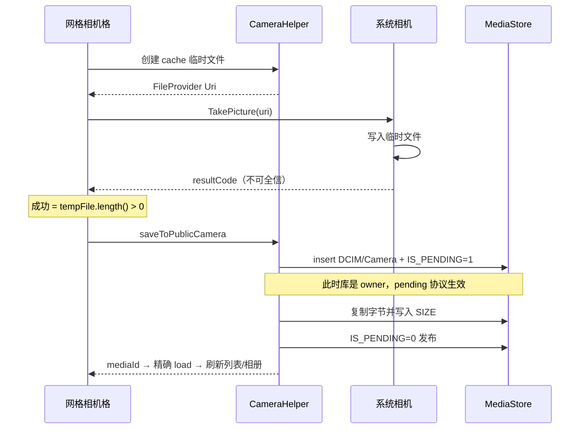

# 别再造轮子了：把实况图、拍照落库、进程死亡都做对的 Android 相册选择器

<p align="center">
  <sub>PhotoChoice&nbsp;·&nbsp;1.1.0&nbsp;·&nbsp;Apache&nbsp;2.0&nbsp;·&nbsp;minSdk&nbsp;29</sub><br>
  <a href="https://github.com/Hu12037102/photo_choice">GitHub</a>
  &nbsp;·&nbsp;
  <code>com.github.Hu12037102:photo_choice:1.1.0</code>
</p>

<p align="center">
  
</p>

---

「选几张图上传」这个需求，做过的都知道水有多深：MediaStore 分页、三套版本的权限申请、进程被杀后回调丢失、某些机型拍照写不进 Uri、实况图被当成普通 JPEG 处理……每一条单拎出来都能耗掉几天。

系统 Photo Picker 轻是轻，但定制空间小；开源选择器不少，可真正把实况图、拍照落库、进程死亡这几件事默认做对的，我没找到。所以写了 PhotoChoice：Builder 配置 + Contract 启动，接入大概半天到一天。

---

## 先看 30 秒

网格 · 相册 · 序号 · 滚动日期 · 拍照 · 预览 · 视频 · 实况 · 裁剪 · 压缩 · 深浅色

<video src="https://huxiaobai.oss-cn-shanghai.aliyuncs.com/open/demo.mp4" controls="controls" width="100%" poster="https://raw.githubusercontent.com/Hu12037102/photo_choice/master/docs/demo-poster.png">
您的环境暂不支持内嵌播放，请<a href="https://huxiaobai.oss-cn-shanghai.aliyuncs.com/open/demo.mp4">点击这里在线观看演示视频</a>。
</video>

<p align="center">
  <sub>
    网页内可直接播放 ·
    <a href="https://huxiaobai.oss-cn-shanghai.aliyuncs.com/open/demo.mp4">在线观看</a>
    · 若播放器未显示，用编辑器「上传视频」，或点上方链接
  </sub>
</p>

---

## 一、先聊聊现有的两个标杆

写选择器绕不开两个前辈，先把它们摆出来，免得像在真空里自卖自夸。

| 项目 | 定位 | 生态体量 |
|------|------|----------|
| [LuckSiege/PictureSelector](https://github.com/LuckSiege/PictureSelector) | 功能最全的「瑞士军刀」：图/视频/音频、拍照、多图裁剪、压缩、主题与布局注入、自定义相机 | 1.3万+ Star，国内业务接入极广 |
| [zhihu/Matisse](https://github.com/zhihu/Matisse) | 知乎开源：体验精致、主题/滤镜可扩展、加载引擎可插拔 | 1.2万+ Star，很多团队的交互参考 |

### 1. PictureSelector：功能最全，复杂度也最高

覆盖面没得说：相册、拍照、预览、裁剪、压缩、音频都有，还能注入自定义相机和数据源；主题布局可以深度定制，Maven 也按 selector / compress / ucrop / camerax 拆了包，按需引入。

代价是接入门槛：要自己提供 `ImageEngine`（Glide/Picasso/Coil）；权限面历史上偏宽，Android 13/14 的权限故事得业务自己理顺；API 面很大——引擎注入、沙盒转换、权限拦截、编辑拦截，适合需要完全可控的中大型 App。另外实况图不是它的重点，多数接入方还是把 Motion Photo 当普通 JPEG，动效在预览和上传里就丢了。

如果你要的是一个可深度定制的媒体中台，选它没错。如果只是想两天接完头像上传，它偏重了。

### 2. Matisse：经典，但确实老了

Matisse 的代码和交互到今天仍然值得读：Activity/Fragment 双入口、主题和过滤器可替换、结构干净，当年很多团队照着它抄交互。

问题在于维护基本停滞：Android 10 的 Scoped Storage、13 的细分媒体权限、14 的部分授权，都得自己打补丁；裁剪和压缩不内置，头像场景还要再接 UCrop、Luban；实况图没有；启动方式也还是老式回调，和 `ActivityResultContract` 这一代 API 有代差。

拿来当参考实现很好。直接上生产的话，外面还得自己包一层现代 Android 的适配壳。

### 3. PhotoChoice 的位置

| 维度 | PictureSelector | Matisse | PhotoChoice |
|------|-----------------|---------|-------------|
| 功能广度 | 极强（含音频、多图裁剪、布局注入） | 中（选图/视频为主） | 中高（图/视频/拍照/单图裁剪/压缩） |
| UI 深度定制 | 强 | 强 | 弱（浅/深/跟随系统，不改宿主全局） |
| 实况图 | 基本需自研 | 无 | 角标 + 长按播放 + 导出策略 |
| 拍照落库 | 能力有，OEM 细节看接入方 | 弱/需自接 | 针对 pending owner 隔离重做（1.1.0） |
| 进程死亡 | 看具体接入方式 | 传统回调 | Contract 轨零静态状态 |
| 分页模型 | 自有加载器，可扩展 | 自有 | Paging 3 + MediaStore keyset |
| 接入心智 | 引擎/权限/模块多 | 简洁但偏旧 | Builder + Contract，公开 API 面收窄 |
| minSdk | 更低（覆盖老机） | 更低 | 29（Android 10+） |

所以选型很简单：

- 要换肤、多图裁剪、音频、自定义相机——继续用 PictureSelector。
- 想学选择器架构、抄交互——读 Matisse。
- 要实况图体验对齐系统相册、拍照在各家 ROM 都能落盘、杀进程还能拿回结果——可以试试 PhotoChoice。

---

## 二、做对了哪几件事

### 1. 实况图当正经功能做

手机相册里「能动的照片」越来越多：Motion Photo、Google Motion Photo、三星动态照片。业务对它的需求其实就三条：

1. 网格里一眼认出（LIVE 角标）
2. 预览里长按能播
3. 上传时能选「保留动效」或「导出静态」

PhotoChoice 把这些文件统一按 `IMAGE` 类型下的实况图处理：分页不阻塞、可视区优先嗅探、索引跨进程持久化、压缩时二选一。这三条在别的选择器里通常要自己拼。

<p align="center">
  
</p>

### 2. 拍照落库：1.1.0 重做过一遍

行业常见写法：先插一条 `IS_PENDING=1` 的 MediaStore 行，把 Uri 交给系统相机。

这条路的失败根因不在「没授权」，而在 pending 行的 owner 隔离：MediaProvider 在 SQL 层过滤 `is_pending = 0 OR owner_package = 调用方`。URI 授权绕不过这层——系统相机不是 owner，`openOutputStream` 直接抛 `FileNotFoundException`，磁盘上根本没写进真实字节。

PhotoChoice 改成：

```
私有临时文件 + FileProvider
        ↓
系统相机写入（成功判据 = 文件有内容，不迷信 resultCode）
        ↓
库作为 owner 复制进 DCIM/Camera，走 IS_PENDING 两阶段发布
```

宿主零额外配置；authority 用 `${applicationId}.photochoice.fileprovider`，多个 App 同装也不冲突。

### 3. Contract 优先：抗重建、抗进程死亡

配置走 Intent Extra，结果走 `setResult`，全程无静态状态。用户切去相机、切去微信、系统杀后台——这些线上天天发生。旧轨 `forResult` 回调用静态字段，仅作兼容，文档里明确写了生产请用 Contract。

### 4. 大相册性能 + 配置防御

- Paging 3 + keyset 分页，不做全量 Cursor
- 分页路径不做 XMP 解析，实况嗅探全部异步
- 非法参数回落修正，无效组合静默降级（多选/视频关裁剪，VIDEO 模式藏相机）——宿主传错参数不会换来 Crash

---

## 三、实现原理

### 3.1 整体架构

```
宿主 App
  └─ PhotoChoice.Builder → PhotoChoiceConfig
        ├─ PhotoChoiceContract ──Intent──► PhotoChoiceActivity   ← 推荐
        └─ forResult(callback) ─static──► PhotoChoiceActivity   ← 兼容旧轨
                ├─ MediaGridFragment + AlbumDropdown
                │     ├─ Paging 3 ← MediaPagingSource (DATE_ADDED+_ID)
                │     ├─ MediaRepository / AlbumRepository
                │     └─ MotionPhoto*（异步，不进 paging load）
                ├─ PreviewActivity（图 / 视频 / 实况长按）
                ├─ CropActivity（单选纯图可选）
                └─ CompressHelper / CameraHelper / SandboxCleaner
                        ▼
                PhotoChoiceResult(uris, paths)
```

公开 API 刻意收窄：`PhotoChoice` / `Builder` / `PhotoChoiceContract` / `PhotoChoiceResult` / `config.*` / `PermissionHelper`。内部 Activity 不要直接启动。AAR 自带 `consumer-rules.pro`，宿主 R8 自动 keep 公开入口与 Intent 配置。

<p align="center">
  
</p>

---

### 3.2 实况图检测：五级判定

只靠 `MediaStore.IS_MOTION_PHOTO`（API 34+）不够，大量国产 OEM 根本不落这个字段。要是在 `onBindViewHolder` 里现开 fd 读 XMP，快滑时角标一定「迟到弹出」。

思路是把判定从「滚动时现算」改成「绑定前尽量已知」：

```
bind 时成本从低到高：
  L0  MediaStore.isMotionPhoto     → 确定动图
  L1  内存 LruCache                → 确定动/静
  L2  持久化 IndexStore            → 跨进程/跨会话 O(1)
  L3  文件名启发式（MVIMG_ 等）    → 疑似显示，待校正
  L4  未知 → 异步 XMP 头尾嗅探 → 回写 L1/L2，角标淡入
```

几条工程约束：

| 约束 | 原因 |
|------|------|
| 分页 `load` 不做 XMP | 冷启动与快滑不能被磁盘 IO 绑死 |
| 双通道嗅探 | 高优先级覆盖可视区+预取，低优先级后台补全，历史队列不拖累快滑 |
| 索引持久化 | bind 前查表，而不是 bind 时算——这就是系统相册能同帧出角标的原因 |
| 启发式宁漏不错 | L3 只做零 IO 的首显加速，最终以 L4 校正 |
| 负缓存 | 确认「不是实况」的也要记住，同一张图不反复嗅探 |

预览侧：长按播放内嵌短视频，松手停止；进入预览时后台解析并缓存内嵌 MP4（目录有容量和 TTL 上限）。开启压缩时，用户可以在保留动效（默认，原样返回 URI）与导出静态 JPEG 之间选——上传链路真正需要的是这个选择权，不只是「认出来」。

---

### 3.3 拍照落库：pending owner 隔离与「成功判据」

这是 1.1.0 的核心修复，也解释了很多「明明拍了照却找不到」的线上问题。

错误心智：

```
insert(IS_PENDING=1) → EXTRA_OUTPUT=该 Uri → 系统相机写入 → 清 pending
```

真实的失败点：相机不是 pending 行的 owner，写入失败。这时如果相机仍返回 `RESULT_OK`、你照旧清 pending，图库里就多了一张 0 字节坏图；如果返回 `CANCELED`、你删掉行，用户看到的是「什么都没发生」。更麻烦的是部分 ROM 写成功了也返回 `CANCELED`。

正确的做法是把写入权和发布权分开：



配套的正确性细节：

- 落库失败回滚删除 MediaStore 行，不留孤儿
- 显式写 `SIZE`，避免 `minImageSize` 把新照片在 SQL 层滤掉
- 无相机 App 时明确提示，不吞 `ActivityNotFoundException`
- 拍照中间态进 `onSaveInstanceState`，跳转相机期间进程被回收也能恢复
- 多选自动选中；单选+裁剪直达裁剪页；不强制切换用户当前浏览的相册

PictureSelector 通过自定义相机或拦截器也能做到类似正确性，但默认路径是否踩过 pending owner，取决于版本和接入方式。PhotoChoice 把默认路径的正确性当成版本承诺来维护。

---

### 3.4 分页：Keyset，而不是 OFFSET

`MediaPagingSource` 用 `(dateAdded, id)` 复合游标向旧翻页：

```text
WHERE (date_added < ?) OR (date_added = ? AND _id < ?)
ORDER BY date_added DESC, _id DESC
LIMIT pageSize
```

不用 `OFFSET` 的原因：相册持续有新照片插入时，OFFSET 会漂移、重复或漏项；大 OFFSET 在 MediaStore 上也越来越贵。

Paging 配置故意不设 `maxSize` 淘汰：预览页需要稳定的全集位置感和回滑体验，而元数据条目远小于位图，淘汰带来的复杂度（页回填、锚点跳动）得不偿失。

首批约 500 条（按列数对齐整行），页大小和预取距离跟 `spanCount` 挂钩，在首屏信息密度和单次查询成本之间取了个折中。

---

### 3.5 启动模型：为什么推荐 Contract

| | `PhotoChoiceContract` | `forResult` 静态回调 |
|--|----------------------|----------------------|
| 配置传递 | Intent Extra（系统托管） | 静态字段 |
| 结果回传 | `setResult` | 静态 callback |
| Activity 重建 | 安全 | 回调可能指向旧实例 |
| 进程死亡 | 可恢复（系统侧） | 结果丢失，安静失败 |
| 推荐场景 | 生产默认 | 快速 Demo / 遗留代码 |

静态回调在进程死亡后拿不回结果，这是组件生命周期决定的，换什么写法都绕不过去。系统对后台的限制一年比一年狠，回调式接入在线上丢结果的概率只会越来越高。

---

### 3.6 压缩：不是无脑再 encode 一遍

完成时对静态图做等比缩放 + JPEG 质量循环：

- 默认最长边 1280、质量 80、目标约 1.5MB；质量下限 50、步长 10
- 小图豁免：长边 ≤ 1280 且短边 ≤ 720，或小于 150KB，原样返回——再压只掉画质
- 视频 / GIF / 保留动效的实况：不压
- 实况「导出静态」会绕过小图豁免，保证上传侧体积可控

产物在 `cacheDir/photo_choice/`，库内 24h TTL；业务消费完 `file://` 后调用 `PhotoChoice.cleanup(context)`。注意先用后清，还在持有的 Uri 清完就失效了。

裁剪仅在 `selectCount == 1 && mediaType == IMAGE` 时生效；`ALL` 或多选下即使 `enabled=true` 也静默降级。这样不会出现「开了裁剪却永远进不去」的幽灵配置。

---

## 四、五分钟接入

### 1. 依赖

```kotlin
// settings.gradle.kts
dependencyResolutionManagement {
    repositories {
        google()
        mavenCentral()
        maven { url = uri("https://jitpack.io") }
    }
}

// app/build.gradle.kts
implementation("com.github.Hu12037102:photo_choice:1.1.0")
```

### 2. 权限（宿主必须声明并申请）

```kotlin
if (PermissionHelper.hasMediaPermission(context)) {
    openPhotoChoice()
} else {
    requestPermissionLauncher.launch(PermissionHelper.requiredMediaPermissions())
}
```

| 系统 | 权限 |
|------|------|
| API 34+ | `READ_MEDIA_IMAGES` / `READ_MEDIA_VIDEO` / `READ_MEDIA_VISUAL_USER_SELECTED`（部分授权也可用） |
| API 33 | 图片 + 视频媒体读权限 |
| API 29–32 | `READ_EXTERNAL_STORAGE` |

### 3. Contract（推荐）

```kotlin
val launcher = registerForActivityResult(PhotoChoiceContract()) { result ->
    if (result == null) return@registerForActivityResult
    result.uris.forEach { uri -> /* 按选中顺序 */ }
}

launcher.launch(
    PhotoChoice.with(this)
        .selectCount(9)
        .mediaType(MediaType.IMAGE)
        .spanCount(4)
        .showCamera(true)
        .buildConfig()
)
```

### 4. 头像：单选 + 正方形裁剪 + 压缩

```kotlin
launcher.launch(
    PhotoChoice.with(this)
        .selectCount(1)
        .mediaType(MediaType.IMAGE)
        .cropConfig(
            CropConfig(enabled = true, aspectRatio = CropAspectRatio.SQUARE)
        )
        .compressConfig(CompressConfig(enabled = true))
        .buildConfig()
)
```

### 5. 和 PictureSelector 的接入体感

```kotlin
// PictureSelector：能力强，但通常要先接 Engine + 按需模块
PictureSelector.create(this)
    .openGallery(SelectMimeType.ofImage())
    .setImageEngine(GlideEngine.createGlideEngine())
    .forResult(object : OnResultCallbackListener<LocalMedia> { /* ... */ })

// PhotoChoice：Engine 内置，Contract 一等，配置收敛在 Builder
launcher.launch(
    PhotoChoice.with(this).selectCount(9).mediaType(MediaType.IMAGE).buildConfig()
)
```

差别不在谁更高级，在默认路径上你要自己写多少适配代码。

---

## 五、什么时候选谁

| 你的诉求 | 更合适的选择 |
|----------|----------------|
| 系统级轻量选图，定制少、尽量无权限 | 系统 Photo Picker |
| 要换肤、多图裁剪、音频、自定义相机、布局注入 | PictureSelector |
| 学习选择器架构 / 主题扩展样本 | Matisse（建议当参考，慎直接上生产） |
| 要实况图角标 + 长按播放 + 导出策略 | PhotoChoice |
| 要拍照在各 ROM 稳定进「相机」相册 | PhotoChoice |
| 要杀进程仍能拿回结果 | PhotoChoice Contract |
| 要两天接完头像/发帖选图，且不污染宿主主题 | PhotoChoice |
| minSdk &lt; 29，或必须读私有/隐藏目录 | 暂不适合 PhotoChoice |
| UI 强调色 / 布局要深度换肤 | 暂不适合 PhotoChoice（请看 PictureSelector） |

---

## 六、已知边界

做不到的提前说清楚，省得接完才发现：

- 数据源只有公共 MediaStore，不含 App 私有目录
- UI 只开放 `ThemeMode` 三档，强调色不可定制
- 裁剪不支持多选与 `MediaType.ALL`
- 部分 OEM 没有 `IS_MOTION_PHOTO` 字段时，极冷门文件名的角标首次出现仍可能淡入一次
- 压缩输出恒为 JPEG，带透明通道的 PNG/WebP 会丢透明

---

## 七、动手试

<p align="center">
  
  <br />
  <sub>
    扫码安装 ·
    <a href="https://github.com/Hu12037102/photo_choice">GitHub</a> ·
    <a href="https://huxiaobai.oss-cn-shanghai.aliyuncs.com/open/sample-release.apk">APK</a> ·
    <a href="https://huxiaobai.oss-cn-shanghai.aliyuncs.com/open/demo.mp4">演示视频</a>
  </sub>
</p>

相册选择器不是炫技组件，是几乎每个 App 都绕不开的基建。PhotoChoice 关注的就是最容易出线上问题的那几条链路：实况图、拍照落库、进程死亡、大相册分页。

如果这几条正好是你踩过的坑，欢迎把 `1.1.0` 接进下一个迭代试试，Issue / PR 都欢迎。Apache 2.0，可商用。觉得有用的话点个 Star。

---

<p align="center">
  <sub>
    PhotoChoice&nbsp;1.1.0&nbsp;·
    <a href="https://github.com/Hu12037102/photo_choice">源码仓库</a>&nbsp;·
    <a href="https://jitpack.io/#Hu12037102/photo_choice">JitPack</a>&nbsp;·
    <a href="https://huxiaobai.oss-cn-shanghai.aliyuncs.com/open/sample-release.apk">示例 APK</a>&nbsp;·
    <a href="https://huxiaobai.oss-cn-shanghai.aliyuncs.com/open/demo.mp4">演示视频</a>
  </sub>
</p>
