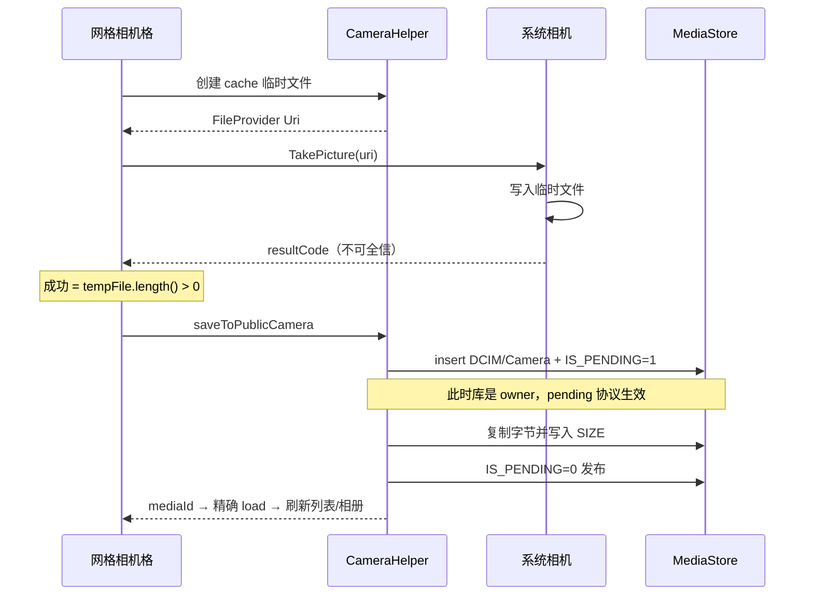

# 别再造轮子了：把实况图、拍照落库、进程死亡都做对的 Android 相册选择器

<p align="center">
  <sub>PhotoChoice&nbsp;·&nbsp;1.1.0&nbsp;·&nbsp;Apache&nbsp;2.0&nbsp;·&nbsp;minSdk&nbsp;29</sub><br>
  <a href="https://github.com/Hu12037102/photo_choice">GitHub</a>
  &nbsp;·&nbsp;
  <code>com.github.Hu12037102:photo_choice:1.1.0</code>
</p>

<p align="center">
  
</p>

---

「选几张图上传」听起来像半天活，落地却是一整条坑链：MediaStore 分页、权限分档、进程被杀丢回调、OEM 相机写不进 Uri、实况图当静态图处理……

系统 Photo Picker 够轻但偏窄；开源选择器很多，真把 **实况图、拍照落库、进程死亡安全** 收成默认正确路径的并不多。

PhotoChoice 做的就是这件事——Builder + Contract 接入，两天能接完，不必再为 ROM 玄学单独开 sprint。

---

## 先看 30 秒

网格 · 相册 · 序号 · 滚动日期 · 拍照 · 预览 · 视频 · 实况 · 裁剪 · 压缩 · 深浅色

<p align="center">
  
</p>

<video src="https://huxiaobai.oss-cn-shanghai.aliyuncs.com/open/demo.mp4" controls="controls" width="100%" poster="https://raw.githubusercontent.com/Hu12037102/photo_choice/master/docs/demo-poster.png">
您的环境暂不支持内嵌播放，请<a href="https://huxiaobai.oss-cn-shanghai.aliyuncs.com/open/demo.mp4">点击这里在线观看演示视频</a>。
</video>

<p align="center">
  <sub>
    网页内可直接播放 ·
    <a href="https://huxiaobai.oss-cn-shanghai.aliyuncs.com/open/demo.mp4">在线观看</a>
    · 若播放器未显示，用编辑器「上传视频」，或点上方链接
  </sub>
</p>

<p align="center">
  
  <br />
  <sub>扫码安装 Demo · Android 10+ · <a href="https://huxiaobai.oss-cn-shanghai.aliyuncs.com/open/sample-release.apk">电脑端下载 APK</a></sub>
</p>

---

## 写在前面

开源生态不缺选择器。真正值得问的是：

**2026 年，你还缺「功能清单更长」的库，还是「几条难而正确路径」被工程化收干净的库？**

PhotoChoice 选后者：实况图一等公民、Scoped Storage 下拍照落库、Contract 抗进程死亡、大相册分页、防御性配置——宿主只声明权限并启动 Contract。

---

## 一、对标：GitHub 上最好的两款

要说「凭啥用你」，先把标杆摆上台面。星标与行业心智最强的两款几乎没有争议：

| 项目 | 大致定位 | 生态体量（量级） |
|------|----------|------------------|
| [LuckSiege/PictureSelector](https://github.com/LuckSiege/PictureSelector) | 功能最全的「瑞士军刀」：图/视频/音频、拍照、多图裁剪、压缩、主题与布局注入、自定义相机…… | **1.3万+ Star**，国内业务接入极广 |
| [zhihu/Matisse](https://github.com/zhihu/Matisse) | 知乎开源的精品选择器：体验精致、主题/滤镜可扩展、加载引擎可插拔 | **1.2万+ Star**，设计与 API 洁癖的标杆 |

下面用「选型视角」而不是「踩一捧一」来拆。

### 1. PictureSelector：能力天花板，复杂度也在天花板

它赢在 **覆盖面**：

- 相册 + 拍照 + 预览 + 裁剪 + 压缩 + 音频，甚至可注入自定义相机 / 自定义数据源
- 主题与布局可深度定制，UI 能贴微信 / 数字角标 / 白色风格等多套皮肤
- Maven 组件化拆分（selector / compress / ucrop / camerax），可按需引入

它也意味着 **接入与维护成本**：

- 需要自行提供 `ImageEngine`（Glide/Picasso/Coil）
- 权限面历史上偏宽（存储读写、相机、录音、部分机型还涉及管理类权限），业务侧要自己把 Android 13/14 权限故事讲圆
- API 面大：引擎注入、沙盒转换、权限拦截、编辑拦截……适合「要完全可控」的中大型 App，对「两天接完头像上传」的团队偏重
- **实况图 / Motion Photo 并非一等能力**：多数业务仍把它当普通 JPEG，动效在预览与上传链里直接消失

一句话：**PictureSelector 适合「我要一个可深度定制的媒体中台」；不适合「我只想把正确路径默认做对」。**

### 2. Matisse：美学与扩展性的经典，但时代变了

Matisse 赢在 **产品品味与结构**：

- Activity/Fragment 双入口清晰
- 内置主题 + 自定义主题，过滤器、加载器可替换
- 代码干净，曾是无数团队「抄交互」的参考实现

它的现实问题也很明确：

- 仓库维护节奏明显放缓，Android 10+ Scoped Storage、Android 13 细分媒体权限、Android 14 部分授权，需要业务自己补丁
- **原生不带裁剪 / 压缩闭环**，头像场景还要再接 UCrop、Luban 一类组件
- 同样 **没有实况图管线**
- 启动与结果更多依赖传统回调心智，和如今推荐的 `ActivityResultContract` 一代 API 有代差

一句话：**Matisse 适合当设计参考；2026 年直接上生产，你大概率还要再包一层「现代 Android 适配壳」。**

### 3. PhotoChoice 站在什么坐标上？

| 维度 | PictureSelector | Matisse | **PhotoChoice** |
|------|-----------------|---------|-----------------|
| 功能广度 | 极强（含音频、多图裁剪、布局注入） | 中（选图/视频为主） | 中高（图/视频/拍照/单图裁剪/压缩） |
| UI 深度定制 | 强 | 强 | 弱（浅/深/跟随系统，不改宿主全局） |
| 实况图 | 基本需自研 | 无 | **一等公民（角标+长按播放+导出策略）** |
| 拍照落库 | 能力有，OEM 细节看接入方 | 弱/需自接 | **针对 pending owner 隔离重做（1.1.0）** |
| 进程死亡 | 看具体接入方式 | 偏传统回调 | **Contract 轨零静态状态** |
| 分页模型 | 自有加载器，可扩展 | 自有 | **Paging 3 + MediaStore keyset** |
| 接入心智 | 引擎/权限/模块多 | 简洁但偏旧 | **Builder + Contract，公开 API 面刻意收窄** |
| minSdk | 更低（覆盖老机） | 更低 | **29（Android 10+）** |
| 维护叙事 | 功能持续叠加 | 经典但老化 | 聚焦「难而正确」的几条链路 |

**诚实结论：**

- 你要微信级换肤、多图裁剪、音频、自定义相机 —— 继续看 PictureSelector。
- 你要极致主题扩展、当学习样本 —— 读 Matisse。
- 你要 **实况图体验对齐现代系统相册、拍照在各 ROM 真能落盘、杀进程还能拿回结果、两天接完还不污染宿主主题** —— 试 PhotoChoice。

差异化不是「星标更多」，而是 **把别人默认留给业务的坑，收进库的默认路径。**

<p align="center">
  
</p>

---

## 二、凭什么值得接入

### 1. 实况图是一等公民，不是事后补丁

手机相册里「能动的照片」越来越多：Motion Photo、Google Motion Photo、三星动态照片……业务通常只想三件事：

1. 网格里一眼认出（LIVE 角标）  
2. 预览里长按能播  
3. 上传时能选「保留动效」或「导出静态」

PhotoChoice 把它们统一视为 `IMAGE` 下的实况图：分页不阻塞、可视区优先嗅探、索引跨进程持久化、压缩策略可二选一。多数选择器把实况图当普通 JPEG——动效在预览和上传链里直接蒸发。

<p align="center">
  
</p>

### 2. 拍照落库按 OEM 真实世界设计（1.1.0 重做）

行业常见写法：先插一条 `IS_PENDING=1` 的 MediaStore 行，把 Uri 交给系统相机。

失败根因不在「没授权」，而在 **pending 行的 owner 隔离**：MediaProvider 在 SQL 层过滤 `is_pending = 0 OR owner_package = 调用方`。URI 授权绕不过这层——系统相机不是 owner，`openOutputStream` 直接 `FileNotFoundException`，磁盘上从未写入真实字节。

PhotoChoice 改为：

```
私有临时文件 + FileProvider
        ↓
系统相机写入（成功判据 = 文件有内容，不迷信 resultCode）
        ↓
库作为 owner 复制进 DCIM/Camera，走 IS_PENDING 两阶段发布
```

宿主零额外配置；authority 用 `${applicationId}.photochoice.fileprovider`，多 App 不冲突。

### 3. Contract 优先：抗重建、抗进程死亡

配置走 Intent Extra，结果走 `setResult`，**全程无静态状态**。用户切相机、切微信、系统杀后台——生产环境天天发生。旧轨 `forResult` 回调用静态字段，仅作兼容；文档明确生产请用 Contract。

### 4. 大相册性能模型 + 配置防御

- Paging 3 + keyset，不做全量 Cursor  
- 分页路径不做 XMP，实况嗅探异步  
- 非法参数回落修正，无效组合静默降级（视频/多选关裁剪，VIDEO 藏相机），**宿主传参失误不换 Crash**

---

## 三、实现原理

### 3.1 整体架构

```
宿主 App
  └─ PhotoChoice.Builder → PhotoChoiceConfig
        ├─ PhotoChoiceContract ──Intent──► PhotoChoiceActivity   ← 推荐
        └─ forResult(callback) ─static──► PhotoChoiceActivity   ← 兼容旧轨
                ├─ MediaGridFragment + AlbumDropdown
                │     ├─ Paging 3 ← MediaPagingSource (DATE_ADDED+_ID)
                │     ├─ MediaRepository / AlbumRepository
                │     └─ MotionPhoto*（异步，不进 paging load）
                ├─ PreviewActivity（图 / 视频 / 实况长按）
                ├─ CropActivity（单选纯图可选）
                └─ CompressHelper / CameraHelper / SandboxCleaner
                        ▼
                PhotoChoiceResult(uris, paths)
```

公开 API 刻意收窄：`PhotoChoice` / `Builder` / `PhotoChoiceContract` / `PhotoChoiceResult` / `config.*` / `PermissionHelper`。内部 Activity **不要直接启动**。AAR 下发 `consumer-rules.pro`，宿主 R8 自动 keep 公开入口与 Intent 配置。

<p align="center">
  
</p>

---

### 3.2 实况图：五级判定级联 —— 对齐「滑到即显」

只靠 `MediaStore.IS_MOTION_PHOTO`（API 34+）不够：大量国产 OEM **根本不落这个字段**。若在 `onBindViewHolder` 里现开 fd 读 XMP，快滑时角标必然「迟到弹出」。

PhotoChoice 的策略是：**把判定从「滚动时现算」改成「绑定前尽量已知」**。

```
bind 时成本从低到高：
  L0  MediaStore.isMotionPhoto     → 确定动图
  L1  内存 LruCache                → 确定动/静
  L2  持久化 IndexStore            → 跨进程/跨会话 O(1)
  L3  文件名启发式（MVIMG_ 等）    → 疑似显示，待校正
  L4  未知 → 异步 XMP 头尾嗅探 → 回写 L1/L2，角标淡入
```

关键工程约束：

| 约束 | 原因 |
|------|------|
| **分页 `load` 不做 XMP** | 冷启动与快滑不能被磁盘 IO 绑死 |
| **双通道嗅探** | 高优先级覆盖可视区+预取；低优先级后台补全，避免历史队列拖死快滑 |
| **索引持久化** | 对齐「微信为什么能同帧显示」——bind 前查表，而不是 bind 时算 |
| **宁漏不错的启发式** | L3 只做零 IO 加速首显，最终以 L4 校正 |
| **负缓存** | 明确「不是实况」的也要记住，避免同一张图被反复嗅探 |

预览侧：长按播放内嵌短视频，松手停止；进入预览时后台解析并缓存内嵌 MP4（目录带容量/TTL 上限）。开启压缩时，用户可在 **保留动效（默认，原样 URI）** 与 **导出静态 JPEG** 之间选择——这是上传链路真正需要的产品语义，而不只是「认出来」。

> 对比：PictureSelector / Matisse 若要同等体验，通常要在宿主侧自建一套索引 + 预览播放器 + 导出策略。PhotoChoice 把这条链路收进库默认行为。

---

### 3.3 拍照落库：pending owner 隔离与「成功判据」

这是 1.1.0 的核心修复，也是很多「拍了照却没有」的根因教案。

**错误心智：**

```
insert(IS_PENDING=1) → EXTRA_OUTPUT=该 Uri → 系统相机写入 → 清 pending
```

**真实失败点：** 相机不是 pending 行 owner → 写失败；若仍 `RESULT_OK` 再清 pending，图库里可能是 **0 字节坏图**；若返回 `CANCELED` 再删行，用户只看到「什么都没发生」。更糟的是：部分 ROM **写完了仍返回 CANCELED**。

**正确拆分：写入权与发布权分离**



附带正确性细节（这些才是「像个 SDK」而不是 Demo）：

- 落库失败回滚删除 MediaStore 行，不留孤儿  
- 显式写 `SIZE`，避免 `minImageSize` 把新照片 SQL 滤掉  
- 无相机 App 时明确提示，不吞 `ActivityNotFoundException`  
- 拍照中间态进 `onSaveInstanceState`，跳转相机期间进程回收可恢复  
- 多选自动选中；单选+裁剪则直达裁剪页；**不强制切换用户当前相册**

PictureSelector 等可以通过自定义相机 / 拦截器达到类似正确性，但默认路径是否踩过 pending owner，取决于版本与接入方式。PhotoChoice 把「默认就正确」当成版本承诺。

---

### 3.4 分页：Keyset，而不是 OFFSET，更不是一次拉全库

`MediaPagingSource` 用 `(dateAdded, id)` 复合游标向旧翻页：

```text
WHERE (date_added < ?) OR (date_added = ? AND _id < ?)
ORDER BY date_added DESC, _id DESC
LIMIT pageSize
```

为什么不用 `OFFSET`？

- 相册持续插入时，OFFSET 会漂移、重复或空洞  
- 大 OFFSET 在 MediaStore 上越来越贵  

为什么 Paging 配置 **故意不设 maxSize 淘汰**？

- 预览页需要稳定的「全集位置感」与回滑体验  
- 元数据条目远小于位图；淘汰带来的复杂度（回填、锚点跳动）收益为负  

首批量约 500（按列数对齐整行），页大小与预取跟 `spanCount` 挂钩——在「首屏信息密度」和「单次查询成本」之间取工程折中。

---

### 3.5 启动模型：为什么 Contract 是一等公民

| | `PhotoChoiceContract` | `forResult` 静态回调 |
|--|----------------------|----------------------|
| 配置传递 | Intent Extra（系统托管） | 静态字段 |
| 结果回传 | `setResult` | 静态 callback |
| Activity 重建 | 安全 | 回调可能指向旧实例 |
| 进程死亡 | 可恢复（系统侧） | 结果丢失，安静失败 |
| 推荐场景 | **生产默认** | 快速 Demo / 遗留代码 |

这不是 API 口味问题，是 **Android 组件生命周期的基本事实**。Matisse 时代大量回调写法在「后台受限越来越狠」的系统上，线上丢结果概率只增不减。

---

### 3.6 压缩：不是无脑再 encode 一遍

完成时对静态图做等比缩放 + JPEG 质量循环：

- 默认最长边 1280、质量 80、目标约 1.5MB，质量下限 50、步长 10  
- **小图豁免**：长边≤1280 且短边≤720，或 &lt;150KB → 原样返回（再压只掉画质）  
- 视频 / GIF / **保留动效的实况** → 不压  
- 实况「导出静态」会绕过小图豁免，确保上传侧体积可控  

产物在 `cacheDir/photo_choice/`，库内 24h TTL；业务消费完 `file://` 后应调用 `PhotoChoice.cleanup(context)`——**先用后清**，否则持有的 Uri 会失效。

裁剪仅在 `selectCount == 1 && mediaType == IMAGE` 生效；`ALL` / 多选即使 `enabled=true` 也会静默降级。这是产品语义收敛，避免「开了裁剪却永远进不去」的幽灵配置。

---

## 四、五分钟接入

### 1. 依赖

```kotlin
// settings.gradle.kts
dependencyResolutionManagement {
    repositories {
        google()
        mavenCentral()
        maven { url = uri("https://jitpack.io") }
    }
}

// app/build.gradle.kts
implementation("com.github.Hu12037102:photo_choice:1.1.0")
```

### 2. 权限（宿主必须声明并申请）

```kotlin
if (PermissionHelper.hasMediaPermission(context)) {
    openPhotoChoice()
} else {
    requestPermissionLauncher.launch(PermissionHelper.requiredMediaPermissions())
}
```

| 系统 | 权限 |
|------|------|
| API 34+ | `READ_MEDIA_IMAGES` / `READ_MEDIA_VIDEO` / `READ_MEDIA_VISUAL_USER_SELECTED`（部分授权也可用） |
| API 33 | 图片 + 视频媒体读权限 |
| API 29–32 | `READ_EXTERNAL_STORAGE` |

### 3. Contract（推荐）

```kotlin
val launcher = registerForActivityResult(PhotoChoiceContract()) { result ->
    if (result == null) return@registerForActivityResult
    result.uris.forEach { uri -> /* 按选中顺序 */ }
}

launcher.launch(
    PhotoChoice.with(this)
        .selectCount(9)
        .mediaType(MediaType.IMAGE)
        .spanCount(4)
        .showCamera(true)
        .buildConfig()
)
```

### 4. 头像：单选 + 正方形裁剪 + 压缩

```kotlin
launcher.launch(
    PhotoChoice.with(this)
        .selectCount(1)
        .mediaType(MediaType.IMAGE)
        .cropConfig(
            CropConfig(enabled = true, aspectRatio = CropAspectRatio.SQUARE)
        )
        .compressConfig(CompressConfig(enabled = true))
        .buildConfig()
)
```

### 5. 和 PictureSelector「体感对比」的接入差异

```kotlin
// PictureSelector：能力强，但通常要先接 Engine + 按需模块
PictureSelector.create(this)
    .openGallery(SelectMimeType.ofImage())
    .setImageEngine(GlideEngine.createGlideEngine())
    .forResult(object : OnResultCallbackListener<LocalMedia> { /* ... */ })

// PhotoChoice：Engine 内置，Contract 一等，配置收敛在 Builder
launcher.launch(
    PhotoChoice.with(this).selectCount(9).mediaType(MediaType.IMAGE).buildConfig()
)
```

不是谁高级，是 **默认路径上你要写多少「正确性胶水」**。

---

## 五、什么时候选谁

| 你的诉求 | 更合适的选择 |
|----------|----------------|
| 系统级轻量选图，定制少、尽量无权限 | 系统 Photo Picker |
| 要换肤、多图裁剪、音频、自定义相机、布局注入 | **PictureSelector** |
| 学习优雅选择器架构 / 主题扩展样本 | **Matisse**（建议当参考，慎直接上生产） |
| 要实况图角标+长按播放+导出策略 | **PhotoChoice** |
| 要拍照在各 ROM 稳定进「相机」相册 | **PhotoChoice** |
| 要杀进程仍能拿回结果 | **PhotoChoice Contract** |
| 要两天接完头像/发帖选图，且不污染宿主主题 | **PhotoChoice** |
| minSdk &lt; 29，或必须读私有/隐藏目录 | 暂不适合 PhotoChoice |
| UI 强调色 / 布局要深度换肤 | 暂不适合 PhotoChoice（请看 PictureSelector） |

---

## 六、已知边界

- 数据源：公共 MediaStore，不含 App 私有目录  
- UI：仅 `ThemeMode` 三档，强调色不对外开放  
- 裁剪：不支持多选与 `MediaType.ALL`  
- 部分 OEM 无 `IS_MOTION_PHOTO` 时，极冷门文件名的角标首次仍可能淡入一次  
- 压缩输出恒为 JPEG；带透明通道的 PNG/WebP 会丢透明  

开源组件的信任，一半来自能力，一半来自 **把做不到的事说清楚**。

---

## 七、动手试 · 参与进来

<p align="center">
  
</p>

<p align="center">
  
  <br />
  <sub>
    扫码安装 ·
    <a href="https://github.com/Hu12037102/photo_choice">GitHub</a> ·
    <a href="https://huxiaobai.oss-cn-shanghai.aliyuncs.com/open/sample-release.apk">APK</a> ·
    <a href="https://huxiaobai.oss-cn-shanghai.aliyuncs.com/open/demo.mp4">演示视频</a>
  </sub>
</p>

相册选择器不是炫技组件，是业务基建。标准很朴素：

**少 Crash、少丢结果、少 OEM 玄学、少让产品解释「为什么这张实况图动不了」。**

PictureSelector 证明了「全能中台」的价值，Matisse 证明了「体验与结构」的价值。PhotoChoice 想证明第三件事：

**把 2026 年仍然难而正确的几条链路——实况、拍照落库、进程死亡、大相册分页——做成默认正确，并让接入保持克制。**

省掉一次线上事故，或一次无意义的造轮子：给仓库点个 Star，把 `1.1.0` 接进下一个迭代，或提 Issue / PR。Apache 2.0，欢迎商用。

---

<p align="center">
  <sub>
    PhotoChoice&nbsp;1.1.0&nbsp;·
    <a href="https://github.com/Hu12037102/photo_choice">源码仓库</a>&nbsp;·
    <a href="https://jitpack.io/#Hu12037102/photo_choice">JitPack</a>&nbsp;·
    <a href="https://huxiaobai.oss-cn-shanghai.aliyuncs.com/open/sample-release.apk">示例 APK</a>&nbsp;·
    <a href="https://huxiaobai.oss-cn-shanghai.aliyuncs.com/open/demo.mp4">演示视频</a>
  </sub>
</p>
