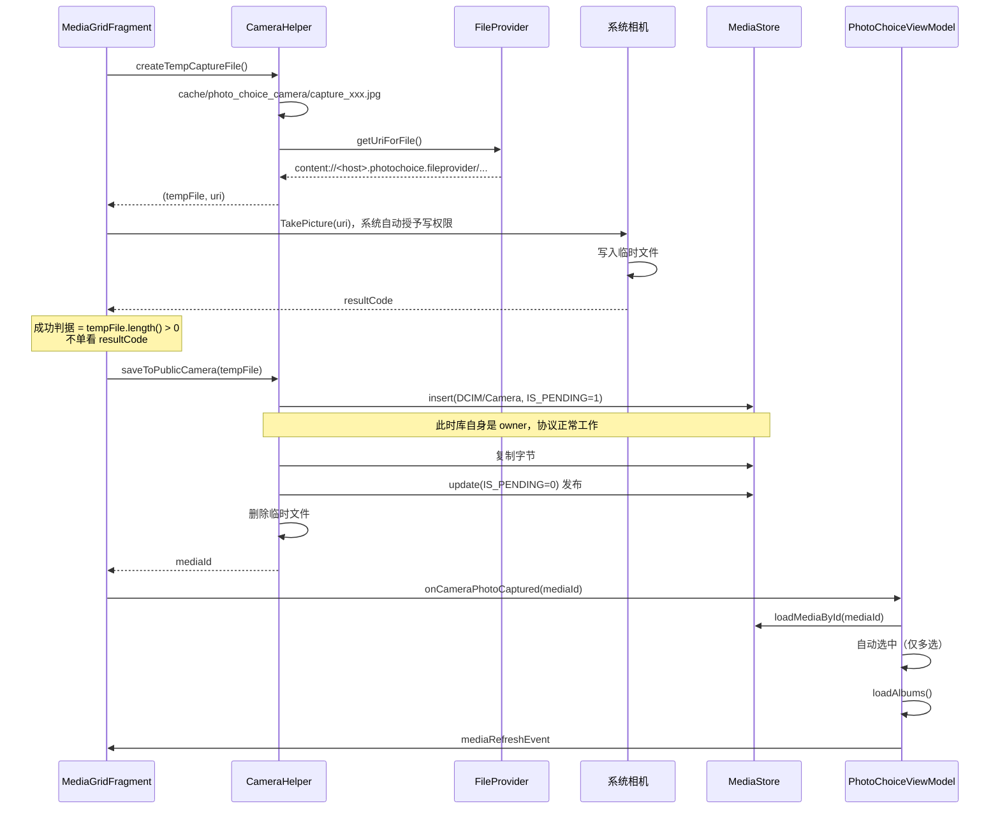

# 相机拍照落库链路重做设计

**日期：** 2026-08-02
**状态：** 已确认
**范围：** 网格首格相机入口的拍照、落库、列表刷新与选中链路

## 1. 背景

网格首格的相机 tile 在 1.0.1 中完全不可用：用户拍照后，照片既不出现在选择器列表中，也不出现在系统图库中，磁盘上只留下一个空目录。

旧实现的流程是：

1. `CameraHelper.createImageUri()` 向 `MediaStore.Images.Media.EXTERNAL_CONTENT_URI` 插入一行，`RELATIVE_PATH` 为 `Pictures/PhotoChoice`，并置 `IS_PENDING = 1`
2. 把这个 MediaStore Uri 通过 `EXTRA_OUTPUT` 交给系统相机（`ActivityResultContracts.TakePicture`）
3. 相机返回 `success = true` 后调用 `publishImage()` 清除 `IS_PENDING`
4. 发出刷新事件，网格 `adapter.refresh()`

### 1.1 失败原因

失败点在第 2 步。`IS_PENDING = 1` 的行在 MediaProvider 中受 **owner 独占**保护：查询与打开文件时，MediaProvider 会在 SQL where 子句层面追加 `is_pending = 0 OR owner_package = <调用方包名>` 的过滤条件。

这层过滤发生在权限检查之前，**URI 授权（`FLAG_GRANT_WRITE_URI_PERMISSION`）无法绕过它**。系统相机不是该行的 owner，因此 `openOutputStream()` 直接抛出 `FileNotFoundException`，照片从未写入磁盘。

> 需要澄清一个常见误解：`EXTRA_OUTPUT` 中的 Uri **确实**能拿到授权——系统 `startActivity` 时会调用 `Intent.migrateExtraStreamToClipData()`，对 `ACTION_IMAGE_CAPTURE` 专门将 `EXTRA_OUTPUT` 迁入 ClipData 并补授权。问题不在授权，而在 pending 行的 owner 隔离。

后续两条路径都导致用户看不到照片：

| 相机返回 | 后续动作 | 结果 |
|----------|----------|------|
| `RESULT_OK` | `publishImage()` 清 pending | 0 字节的行，图库无法解码，不显示 |
| `RESULT_CANCELED` | `delete(uri)` 删除预插行 | 行与占位文件都没了，只剩 insert 时创建的空目录 |

### 1.2 同时暴露的其它缺陷

- 拍照后未调用 `loadAlbums()`，相册下拉中不出现新建的相机相册，计数与封面也不更新
- `takePictureLauncher.launch()` 的 `ActivityNotFoundException` 被 `runCatching` 静默吞掉，无相机应用时用户点击毫无反馈
- 成功判据仅依赖 `resultCode`，部分 ROM 相机写完照片仍返回 `RESULT_CANCELED`，会被误判为取消
- 落库未写入 `SIZE` 列，宿主配置 `minImageSize` 时新照片会被列表 SQL 条件筛掉

## 2. 目标

- 拍照产物稳定落入公共相机目录，在选择器列表与系统图库中均可见
- 落库位置为 `DCIM/Camera`（系统"相机"相册），文件名为 `IMG` + 时间戳后八位 + 四位随机数 + `.jpg`
- 拍照后当前列表与相册聚合数据同步更新
- 不依赖各 OEM 相机应用对 MediaStore Uri 的实现差异
- 任何环节失败都有明确的用户反馈，且不留下孤儿记录或残留文件
- 宿主无需任何额外配置（不新增权限、不要求声明 Provider）

## 3. 非目标

- 不引入应用内自研相机（CameraX 等），继续复用系统相机
- 不支持录像，相机 tile 仅拍摄静态图
- 不提供落库目录与文件名规则的对外配置项
- 不改变已有照片的浏览、选中、裁剪、压缩链路

## 4. 方案

### 4.1 核心思路

不再把 MediaStore Uri 交给系统相机，改为「私有临时文件 + FileProvider」，由库自身完成落库：

FileProvider Uri 不存在 owner 隔离问题，相机应用对其有完整写权限，兼容性最好。落库阶段由库自身作为 owner 执行，`IS_PENDING` 两阶段协议此时才真正生效。

### 4.2 文件命名

`IMG` + 时间戳后八位 + 四位随机数 + `.jpg`，固定 19 字符，例如 `IMG064001234821.jpg`。

- 时间戳后八位使文件名近似按时间有序（10^8 毫秒约 27.8 小时一个循环）
- 四位随机数消除同毫秒连拍碰撞
- 两者均用取模而非字符串截取，避免负数或位数不足时截出错误结果；不足位左补 0，保证长度恒定
- 极端情况下仍重名时，MediaStore 会自动追加 `(1)` 后缀，不会覆盖已有文件

### 4.3 FileProvider 声明

authority 为 `${applicationId}.photochoice.fileprovider`，由宿主 `applicationId` 拼接而成——两个 App 声明同名 authority 会导致后安装的那个直接安装失败，用占位符可保证多个集成方之间不冲突。

运行时用 `context.packageName` 拼出同样的值。**不能**用库自身的 `BuildConfig.APPLICATION_ID`：在库模块中它是库的包名，与 manifest 合并后的实际 authority 对不上。

路径声明仅暴露 `cache/photo_choice_camera/` 一个目录，最小权限。

### 4.4 失败处理与回滚

| 失败点 | 处理 |
|--------|------|
| 临时文件创建失败 | 提示"照片保存失败"，不启动相机 |
| 无相机应用（`ActivityNotFoundException`） | 删除临时文件，提示"未找到可用的相机应用" |
| 相机取消或未写入内容 | 删除临时文件，静默返回（公共目录无任何残留） |
| `insert` 返回 null | 提示"照片保存失败" |
| 字节复制失败 | **删除已插入的 MediaStore 行**，提示"照片保存失败" |
| `publish` 失败 | 记录 error 日志，不中断主流程（照片留在 pending 态，系统后续扫描会兜底） |
| 落库成功但 `loadMediaById` 查不回 | 记录 warn 日志，仍刷新列表，仅跳过自动选中 |

字节复制失败必须回滚，否则媒体库中残留 0 字节行，系统相册会显示为损坏图。

### 4.5 拍照后行为

| 模式 | 行为 |
|------|------|
| 多选 | 自动选中；达 `selectCount` 上限时提示"已达上限"，照片仍保存在相册中 |
| 单选 + 裁剪开启 | 直接进入裁剪页；取消裁剪时回补刷新列表 |
| 单选 + 未开裁剪 | 仅刷新列表与相册数据，不自动选中 |

**单选不自动选中**是刻意设计。单选模式下网格隐藏 checkbox、序号与禁用蒙层，不存在"已选中"的中间态——选中只发生在预览页或裁剪页点击 Done 的瞬间。若在单选下自动选中，会凭空展开一个该模式从不出现、且用户无法取消（网格没有 checkbox）的底部栏，属于引入新的断裂路径。

**不切换相册**：拍照后保持用户当前浏览的相册不变，仅刷新列表与相册聚合。若当前相册不是"相机"，新照片需切换后可见。

### 4.6 查回新照片的过滤策略

`MediaRepository.loadMediaById()` **刻意不带任何过滤条件**（类型、体积、时长）。

拍照产物是用户主动创建的，语义上必须能被选中。若套用宿主配置的过滤条件（例如 `minImageSize`），会出现"拍了照却选不上"的断裂路径。过滤只作用于浏览既有媒体，不作用于本次拍摄结果。

### 4.7 进程死亡恢复

跳转系统相机与裁剪页期间本进程极易被回收，三项中间态随 `onSaveInstanceState` 持久化：

| 状态 | 丢失后果 |
|------|----------|
| 临时文件绝对路径 | 照片已写入却无法落库，彻底丢失 |
| 裁剪来源标记 | 取消裁剪后列表不刷新，照片"隐身" |
| 落库 `mediaId` | 同上，无法回补刷新 |

### 4.8 临时文件清理

正常流程下临时文件在落库完成（或失败）后立即删除。异常中断（进程被杀、拍照途中崩溃）遗留的孤儿文件由 `SandboxCleaner` 兜底：

- L1：进入选择器时 `cleanExpired()`，24 小时 TTL
- L2：宿主调用 `PhotoChoice.cleanup()` → `cleanAll()`，全量清空

## 5. 影响面

| 文件 | 改动 |
|------|------|
| `util/CameraHelper.kt` | 重写：临时文件创建、FileProvider Uri、落库、发布、清理、文件名生成 |
| `res/xml/photochoice_file_paths.xml` | 新增，仅暴露拍照临时目录 |
| `AndroidManifest.xml` | 新增 FileProvider 声明 |
| `util/SandboxCleaner.kt` | 相机临时目录纳入 TTL 与全量清理 |
| `data/MediaRepository.kt` | 新增 `loadMediaById()` |
| `viewmodel/PhotoChoiceViewModel.kt` | `onCameraPhotoCaptured(mediaId)`：自动选中 + `loadAlbums()` + 刷新事件 |
| `ui/grid/MediaGridFragment.kt` | 拍照流程重写、saved state 持久化、失败提示 |
| `res/values*/strings.xml` | 新增两条提示文案 |

对外 API 无变更，宿主无需任何适配。

## 6. 验证

- `CameraFileNamingTest`：锁定文件名格式、补零、越界取模与负数入参行为（7 条用例）
- `:sample:assembleDebug` 构建通过，合并后 manifest 中 authority 正确展开
- 库模块 lint 对本次改动文件无告警

**待真机验证**：落库位置、系统图库可见性、各 OEM 相机的 `resultCode` 行为。
